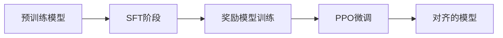

# 第4章：强化学习与RLHF深度解析

从人类反馈中学习（RLHF）已成为构建对齐AI系统的核心技术。本章深入探讨RLHF的理论基础、实践细节和最新进展。

## 章节目录

1. [RL基础与策略梯度方法](#section1)
2. [RLHF的完整流程剖析](#section2)
3. [奖励模型的设计与训练](#section3)
4. [PPO vs DPO vs IPO算法对比](#section4)
5. [Constitutional AI与自我改进](#section5)
6. [RLHF的挑战与未来](#section6)

---

## <a name="section1"></a>4.1 RL基础与策略梯度方法

理解RLHF需要先掌握强化学习的核心概念，特别是策略梯度方法在语言模型中的应用。

### 4.1.1 强化学习在LLM中的形式化

**状态、动作、奖励的定义：**

在语言生成任务中：
- **状态（State）** $s_t$：已生成的token序列 $[x_1, x_2, ..., x_t]$
- **动作（Action）** $a_t$：下一个要生成的token
- **策略（Policy）** $\pi_\theta$：语言模型本身，$P(a_t|s_t)$
- **奖励（Reward）** $r$：通常只在序列结束时给出

**马尔可夫决策过程（MDP）：**
```python
class LanguageGenerationMDP:
    def __init__(self, vocab_size, max_length):
        self.vocab_size = vocab_size
        self.max_length = max_length
        self.eos_token = vocab_size - 1
    
    def step(self, state, action):
        # 状态转移是确定性的
        next_state = state + [action]
        
        # 判断是否结束
        done = (action == self.eos_token or 
                len(next_state) >= self.max_length)
        
        # 奖励延迟到序列结束
        reward = 0  # 将由奖励模型计算
        
        return next_state, reward, done
```

### 4.1.2 策略梯度定理

**目标函数：**
$$J(\theta) = \mathbb{E}_{\tau \sim \pi_\theta}[R(\tau)]$$

其中 $\tau = (s_0, a_0, s_1, a_1, ..., s_T)$ 是一个轨迹。

**策略梯度：**
$$\nabla_\theta J(\theta) = \mathbb{E}_{\tau \sim \pi_\theta}\left[\sum_{t=0}^T \nabla_\theta \log \pi_\theta(a_t|s_t) \cdot A_t\right]$$

其中 $A_t$ 是优势函数（Advantage Function）。

**REINFORCE算法实现：**
```python
def reinforce_update(model, trajectories, optimizer):
    total_loss = 0
    
    for trajectory in trajectories:
        states, actions, rewards = trajectory
        
        # 计算回报（从后向前）
        returns = []
        G = 0
        for r in reversed(rewards):
            G = r + gamma * G
            returns.insert(0, G)
        
        # 归一化回报
        returns = torch.tensor(returns)
        returns = (returns - returns.mean()) / (returns.std() + 1e-8)
        
        # 计算损失
        for t, (state, action, G_t) in enumerate(zip(states, actions, returns)):
            log_prob = model.get_log_prob(state, action)
            loss = -log_prob * G_t
            total_loss += loss
    
    # 更新参数
    optimizer.zero_grad()
    (total_loss / len(trajectories)).backward()
    optimizer.step()
```

### 4.1.3 基线与优势函数

**价值函数基线：**
```python
class ValueNetwork(nn.Module):
    def __init__(self, model_dim):
        super().__init__()
        self.value_head = nn.Sequential(
            nn.Linear(model_dim, model_dim),
            nn.ReLU(),
            nn.Linear(model_dim, 1)
        )
    
    def forward(self, hidden_states):
        # hidden_states: 语言模型的最后隐藏状态
        return self.value_head(hidden_states).squeeze(-1)
```

**广义优势估计（GAE）：**
$$A_t^{GAE} = \sum_{l=0}^{\infty} (\gamma \lambda)^l \delta_{t+l}$$

其中 $\delta_t = r_t + \gamma V(s_{t+1}) - V(s_t)$ 是TD误差。

```python
def compute_gae(rewards, values, next_values, gamma=0.99, lam=0.95):
    advantages = []
    gae = 0
    
    for t in reversed(range(len(rewards))):
        if t == len(rewards) - 1:
            next_value = next_values
        else:
            next_value = values[t + 1]
        
        delta = rewards[t] + gamma * next_value - values[t]
        gae = delta + gamma * lam * gae
        advantages.insert(0, gae)
    
    return torch.tensor(advantages)
```

### 4.1.4 重要性采样与PPO

**重要性采样比率：**
$$r_t(\theta) = \frac{\pi_\theta(a_t|s_t)}{\pi_{\theta_{old}}(a_t|s_t)}$$

**PPO-Clip目标：**
$$L^{CLIP}(\theta) = \mathbb{E}_t\left[\min\left(r_t(\theta)A_t, \text{clip}(r_t(\theta), 1-\epsilon, 1+\epsilon)A_t\right)\right]$$

**PPO实现核心：**
```python
def ppo_loss(model, old_model, states, actions, advantages, epsilon=0.2):
    # 计算新旧策略的log概率
    new_log_probs = model.get_log_probs(states, actions)
    old_log_probs = old_model.get_log_probs(states, actions).detach()
    
    # 重要性采样比率
    ratio = torch.exp(new_log_probs - old_log_probs)
    
    # PPO-Clip损失
    surr1 = ratio * advantages
    surr2 = torch.clamp(ratio, 1 - epsilon, 1 + epsilon) * advantages
    policy_loss = -torch.min(surr1, surr2).mean()
    
    # 价值函数损失
    values = model.get_values(states)
    value_targets = compute_returns(rewards, gamma)
    value_loss = F.mse_loss(values, value_targets)
    
    # 熵正则化（鼓励探索）
    entropy = model.get_entropy(states).mean()
    entropy_loss = -entropy_coef * entropy
    
    total_loss = policy_loss + value_coef * value_loss + entropy_loss
    
    return total_loss, {
        'policy_loss': policy_loss.item(),
        'value_loss': value_loss.item(),
        'entropy': entropy.item()
    }
```

### 4.1.5 KL散度约束

**为什么需要KL约束：**
防止策略更新过大，保持训练稳定性。

**KL惩罚方法：**
$$L(\theta) = \mathbb{E}_t[r_t(\theta)A_t] - \beta \cdot KL[\pi_\theta || \pi_{ref}]$$

```python
def compute_kl_penalty(model, ref_model, states):
    # 获取整个词表上的分布
    new_logits = model(states)
    ref_logits = ref_model(states).detach()
    
    # 转换为概率分布
    new_probs = F.softmax(new_logits, dim=-1)
    ref_probs = F.softmax(ref_logits, dim=-1)
    
    # KL散度
    kl = torch.sum(new_probs * (torch.log(new_probs) - torch.log(ref_probs)), dim=-1)
    
    return kl.mean()

class AdaptiveKLController:
    def __init__(self, init_kl_coef, target_kl):
        self.kl_coef = init_kl_coef
        self.target_kl = target_kl
    
    def update(self, current_kl):
        # 自适应调整KL系数
        if current_kl > 1.5 * self.target_kl:
            self.kl_coef *= 1.5
        elif current_kl < 0.5 * self.target_kl:
            self.kl_coef *= 0.5
        
        return self.kl_coef
```

#### 练习 4.1：实现简化版PPO训练循环
实现一个用于语言模型的PPO训练循环，包括采样、优势计算和参数更新。

<details>
<summary>查看答案</summary>

**简化版PPO训练实现：**

```python
class SimplePPOTrainer:
    def __init__(self, policy_model, ref_model, reward_model, config):
        self.policy = policy_model
        self.ref_policy = ref_model
        self.reward_model = reward_model
        self.config = config
        
        # 优化器
        self.optimizer = AdamW(
            self.policy.parameters(),
            lr=config.learning_rate
        )
        
        # 价值网络
        self.value_net = ValueNetwork(policy_model.config.hidden_size)
        self.value_optimizer = AdamW(
            self.value_net.parameters(),
            lr=config.value_learning_rate
        )
        
        # KL控制器
        self.kl_controller = AdaptiveKLController(
            config.init_kl_coef,
            config.target_kl
        )
    
    def generate_trajectories(self, prompts, num_samples=1):
        """生成轨迹并计算奖励"""
        trajectories = []
        
        for prompt in prompts:
            for _ in range(num_samples):
                # 生成响应
                with torch.no_grad():
                    response, log_probs = self.policy.generate_with_log_probs(
                        prompt,
                        max_length=self.config.max_length,
                        temperature=self.config.temperature
                    )
                
                # 计算奖励
                reward = self.reward_model.compute_reward(prompt, response)
                
                # 计算参考模型的log概率（用于KL）
                ref_log_probs = self.ref_policy.get_log_probs(prompt, response)
                
                trajectories.append({
                    'prompt': prompt,
                    'response': response,
                    'log_probs': log_probs,
                    'ref_log_probs': ref_log_probs,
                    'reward': reward
                })
        
        return trajectories
    
    def compute_advantages(self, trajectories):
        """计算优势函数"""
        for traj in trajectories:
            states = self.get_states(traj['prompt'], traj['response'])
            
            # 计算价值估计
            with torch.no_grad():
                values = self.value_net(states)
            
            # 计算GAE
            rewards = [0] * (len(states) - 1) + [traj['reward']]  # 稀疏奖励
            advantages = compute_gae(
                rewards, 
                values,
                0,  # 终止状态价值为0
                self.config.gamma,
                self.config.gae_lambda
            )
            
            traj['advantages'] = advantages
            traj['returns'] = values + advantages
    
    def update_policy(self, trajectories):
        """PPO策略更新"""
        # 准备批次数据
        states = []
        actions = []
        old_log_probs = []
        advantages = []
        returns = []
        
        for traj in trajectories:
            seq_states = self.get_states(traj['prompt'], traj['response'])
            seq_actions = self.get_actions(traj['response'])
            
            states.extend(seq_states[:-1])  # 除了最后一个状态
            actions.extend(seq_actions)
            old_log_probs.extend(traj['log_probs'])
            advantages.extend(traj['advantages'])
            returns.extend(traj['returns'])
        
        # 转换为张量
        states = torch.stack(states)
        actions = torch.tensor(actions)
        old_log_probs = torch.tensor(old_log_probs)
        advantages = torch.tensor(advantages)
        returns = torch.tensor(returns)
        
        # 归一化优势
        advantages = (advantages - advantages.mean()) / (advantages.std() + 1e-8)
        
        # PPO更新循环
        for _ in range(self.config.ppo_epochs):
            # 随机打乱
            indices = torch.randperm(len(states))
            
            for start in range(0, len(states), self.config.batch_size):
                end = start + self.config.batch_size
                batch_indices = indices[start:end]
                
                # 获取批次
                b_states = states[batch_indices]
                b_actions = actions[batch_indices]
                b_old_log_probs = old_log_probs[batch_indices]
                b_advantages = advantages[batch_indices]
                b_returns = returns[batch_indices]
                
                # 计算新的log概率
                new_log_probs = self.policy.get_log_probs(b_states, b_actions)
                
                # 重要性采样比率
                ratio = torch.exp(new_log_probs - b_old_log_probs)
                
                # PPO损失
                surr1 = ratio * b_advantages
                surr2 = torch.clamp(
                    ratio, 
                    1 - self.config.clip_epsilon,
                    1 + self.config.clip_epsilon
                ) * b_advantages
                
                policy_loss = -torch.min(surr1, surr2).mean()
                
                # 价值损失
                values = self.value_net(b_states)
                value_loss = F.mse_loss(values, b_returns)
                
                # KL惩罚
                kl_penalty = compute_kl_penalty(
                    self.policy,
                    self.ref_policy,
                    b_states
                )
                
                # 总损失
                loss = (policy_loss + 
                       self.config.value_coef * value_loss +
                       self.kl_controller.kl_coef * kl_penalty)
                
                # 更新
                self.optimizer.zero_grad()
                self.value_optimizer.zero_grad()
                loss.backward()
                
                # 梯度裁剪
                torch.nn.utils.clip_grad_norm_(
                    self.policy.parameters(),
                    self.config.max_grad_norm
                )
                
                self.optimizer.step()
                self.value_optimizer.step()
        
        # 更新KL控制器
        with torch.no_grad():
            current_kl = compute_kl_penalty(
                self.policy,
                self.ref_policy,
                states
            ).item()
        
        self.kl_controller.update(current_kl)
    
    def train_step(self, prompts):
        """单步训练"""
        # 1. 生成轨迹
        trajectories = self.generate_trajectories(prompts)
        
        # 2. 计算优势
        self.compute_advantages(trajectories)
        
        # 3. 更新策略
        self.update_policy(trajectories)
        
        # 4. 记录指标
        metrics = self.compute_metrics(trajectories)
        
        return metrics
    
    def compute_metrics(self, trajectories):
        """计算训练指标"""
        rewards = [traj['reward'] for traj in trajectories]
        kl_divs = []
        
        for traj in trajectories:
            kl = torch.sum(
                torch.exp(traj['log_probs']) * 
                (traj['log_probs'] - traj['ref_log_probs'])
            ).item()
            kl_divs.append(kl)
        
        return {
            'mean_reward': np.mean(rewards),
            'std_reward': np.std(rewards),
            'mean_kl': np.mean(kl_divs),
            'kl_coef': self.kl_controller.kl_coef
        }
```

**使用示例：**
```python
# 配置
config = PPOConfig(
    learning_rate=1e-6,
    value_learning_rate=1e-5,
    batch_size=128,
    ppo_epochs=4,
    clip_epsilon=0.2,
    value_coef=0.1,
    init_kl_coef=0.1,
    target_kl=0.01,
    gamma=0.99,
    gae_lambda=0.95,
    max_grad_norm=1.0,
    temperature=0.7,
    max_length=512
)

# 初始化训练器
trainer = SimplePPOTrainer(
    policy_model=policy_model,
    ref_model=ref_model,
    reward_model=reward_model,
    config=config
)

# 训练循环
for epoch in range(num_epochs):
    # 获取训练prompts
    prompts = get_training_prompts(batch_size=32)
    
    # 训练步骤
    metrics = trainer.train_step(prompts)
    
    # 记录日志
    print(f"Epoch {epoch}: {metrics}")
    
    # 定期评估
    if epoch % eval_freq == 0:
        eval_metrics = evaluate_model(trainer.policy)
        print(f"Evaluation: {eval_metrics}")
```

</details>

### 4.1.6 策略梯度的方差缩减技术

**控制变量法：**
```python
def compute_advantages_with_baseline(rewards, values, gamma=0.99):
    advantages = []
    returns = []
    
    # 计算真实回报
    G = 0
    for r in reversed(rewards):
        G = r + gamma * G
        returns.insert(0, G)
    
    # 计算优势（回报 - 基线）
    for ret, val in zip(returns, values):
        advantages.append(ret - val)
    
    return torch.tensor(advantages), torch.tensor(returns)
```

**归一化技巧：**
```python
class RunningMeanStd:
    """运行时均值和标准差估计"""
    def __init__(self, shape=()):
        self.mean = np.zeros(shape, dtype=np.float64)
        self.var = np.ones(shape, dtype=np.float64)
        self.count = 1e-8
    
    def update(self, x):
        batch_mean = np.mean(x, axis=0)
        batch_var = np.var(x, axis=0)
        batch_count = x.shape[0]
        
        delta = batch_mean - self.mean
        self.mean += delta * batch_count / (self.count + batch_count)
        
        m_a = self.var * self.count
        m_b = batch_var * batch_count
        M2 = m_a + m_b + delta**2 * self.count * batch_count / (self.count + batch_count)
        
        self.var = M2 / (self.count + batch_count)
        self.count += batch_count
    
    def normalize(self, x):
        return (x - self.mean) / (np.sqrt(self.var) + 1e-8)
```

**⚡ 设计选择：**
PPO在语言模型中的设计权衡：
- Clip范围：太小限制学习，太大失去稳定性
- KL惩罚：硬约束vs软约束
- 价值函数：独立网络vs共享主干
- 批次大小：大批次稳定但计算昂贵

**🔬 研究线索：**
- 如何更好地处理稀疏奖励问题？
- 离线RL在RLHF中的应用？
- 多目标RL如何平衡不同对齐目标？

---

## <a name="section2"></a>4.2 RLHF的完整流程剖析

RLHF不是单一技术，而是一个包含多个阶段的复杂流程。本节详细剖析每个阶段的设计与实现。

### 4.2.1 RLHF三阶段概览

**完整流程：**



**各阶段的作用：**
1. **SFT（监督微调）**：建立基础能力
2. **奖励建模**：学习人类偏好
3. **RL微调**：优化偏好对齐

### 4.2.2 阶段1：监督微调（SFT）

**为什么需要SFT：**
- 让模型学会基本的指令遵循格式
- 提供良好的初始策略
- 减少RL阶段的探索难度

**SFT数据构建：**
```python
def prepare_sft_data(raw_demonstrations):
    sft_examples = []
    
    for demo in raw_demonstrations:
        # 标准化格式
        formatted_input = format_prompt(demo['instruction'])
        formatted_output = clean_response(demo['response'])
        
        # 质量过滤
        if is_high_quality(formatted_output):
            sft_examples.append({
                'input': formatted_input,
                'output': formatted_output,
                'metadata': {
                    'source': demo.get('source'),
                    'quality_score': rate_quality(formatted_output)
                }
            })
    
    # 去重
    sft_examples = deduplicate(sft_examples)
    
    # 平衡数据分布
    sft_examples = balance_categories(sft_examples)
    
    return sft_examples
```

**SFT训练策略：**
```python
class SFTTrainer:
    def __init__(self, model, config):
        self.model = model
        self.config = config
        
    def train_step(self, batch):
        inputs = self.tokenizer(
            batch['inputs'],
            padding=True,
            truncation=True,
            return_tensors='pt'
        )
        
        targets = self.tokenizer(
            batch['outputs'],
            padding=True,
            truncation=True,
            return_tensors='pt'
        )
        
        # 只计算输出部分的损失
        input_len = inputs['input_ids'].shape[1]
        labels = torch.full_like(inputs['input_ids'], -100)
        labels[:, input_len:] = targets['input_ids']
        
        outputs = self.model(
            input_ids=inputs['input_ids'],
            attention_mask=inputs['attention_mask'],
            labels=labels
        )
        
        return outputs.loss
```

### 4.2.3 阶段2：偏好数据收集

**偏好数据的类型：**

**1. 成对比较：**
```python
class PairwiseComparison:
    def __init__(self, prompt, response_a, response_b, preference):
        self.prompt = prompt
        self.responses = [response_a, response_b]
        self.preference = preference  # 0, 0.5, or 1
        
    def to_training_pair(self):
        if self.preference == 0.5:
            # 平局处理
            return None
        elif self.preference == 1:
            return {
                'chosen': self.responses[0],
                'rejected': self.responses[1],
                'prompt': self.prompt
            }
        else:
            return {
                'chosen': self.responses[1],
                'rejected': self.responses[0],
                'prompt': self.prompt
            }
```

**2. 评分数据：**
```python
def convert_ratings_to_comparisons(rated_responses):
    """将评分转换为成对比较"""
    comparisons = []
    
    # 按prompt分组
    grouped = defaultdict(list)
    for item in rated_responses:
        grouped[item['prompt']].append(item)
    
    # 生成比较对
    for prompt, responses in grouped.items():
        # 按分数排序
        responses.sort(key=lambda x: x['rating'], reverse=True)
        
        # 创建比较对（避免分数太接近的）
        for i in range(len(responses)):
            for j in range(i + 1, len(responses)):
                if responses[i]['rating'] - responses[j]['rating'] > 0.5:
                    comparisons.append({
                        'prompt': prompt,
                        'chosen': responses[i]['response'],
                        'rejected': responses[j]['response'],
                        'margin': responses[i]['rating'] - responses[j]['rating']
                    })
    
    return comparisons
```

**偏好数据质量控制：**
```python
class PreferenceDataValidator:
    def __init__(self):
        self.annotator_agreement_threshold = 0.7
        self.min_margin_threshold = 0.2
    
    def validate_comparison(self, comparison_data):
        # 检查标注者一致性
        if 'annotator_scores' in comparison_data:
            agreement = self.compute_agreement(comparison_data['annotator_scores'])
            if agreement < self.annotator_agreement_threshold:
                return False, "Low annotator agreement"
        
        # 检查偏好强度
        if comparison_data.get('margin', 1.0) < self.min_margin_threshold:
            return False, "Preference margin too small"
        
        # 检查响应质量
        if self.is_degenerate(comparison_data['chosen']):
            return False, "Chosen response is degenerate"
        
        return True, "Valid"
    
    def compute_agreement(self, scores):
        # 计算Krippendorff's alpha或类似指标
        # 简化版：计算标准差
        return 1 - np.std(scores) / np.mean(scores)
```

### 4.2.4 阶段3：奖励模型训练

**奖励模型架构：**
```python
class RewardModel(nn.Module):
    def __init__(self, base_model, config):
        super().__init__()
        self.base_model = base_model
        self.config = config
        
        # 奖励头
        self.reward_head = nn.Linear(
            base_model.config.hidden_size,
            1,
            bias=False
        )
        
        # 初始化
        nn.init.normal_(self.reward_head.weight, std=1e-3)
    
    def forward(self, input_ids, attention_mask=None):
        # 获取基础模型输出
        outputs = self.base_model(
            input_ids=input_ids,
            attention_mask=attention_mask,
            output_hidden_states=True
        )
        
        # 使用最后一个token的隐藏状态
        hidden_states = outputs.hidden_states[-1]
        last_hidden = hidden_states[:, -1, :]
        
        # 计算奖励分数
        reward = self.reward_head(last_hidden)
        
        return reward
```

**奖励模型损失函数：**
```python
def reward_model_loss(reward_model, batch):
    # 获取chosen和rejected的奖励
    chosen_rewards = reward_model(
        batch['chosen_input_ids'],
        batch['chosen_attention_mask']
    )
    
    rejected_rewards = reward_model(
        batch['rejected_input_ids'],
        batch['rejected_attention_mask']
    )
    
    # Bradley-Terry模型损失
    # P(chosen > rejected) = sigmoid(r_chosen - r_rejected)
    logits = chosen_rewards - rejected_rewards
    
    # 如果有偏好强度，可以加权
    if 'preference_margin' in batch:
        # 强偏好的权重更高
        weights = batch['preference_margin']
        loss = -F.logsigmoid(logits * weights).mean()
    else:
        loss = -F.logsigmoid(logits).mean()
    
    # 准确率
    with torch.no_grad():
        accuracy = (logits > 0).float().mean()
    
    return loss, accuracy
```

### 4.2.5 阶段4：PPO训练

**完整PPO流程整合：**
```python
class RLHFPPOTrainer:
    def __init__(self, policy_model, ref_model, reward_model, config):
        self.policy = policy_model
        self.ref_policy = ref_model
        self.reward_model = reward_model
        self.config = config
        
        # 采样参数
        self.generation_config = GenerationConfig(
            max_length=config.max_length,
            temperature=config.temperature,
            top_p=config.top_p,
            do_sample=True
        )
    
    def make_experience(self, prompts):
        """生成经验数据"""
        experiences = []
        
        with torch.no_grad():
            for prompt in prompts:
                # 生成响应
                prompt_ids = self.tokenizer.encode(prompt, return_tensors='pt')
                response_ids = self.policy.generate(
                    prompt_ids,
                    **self.generation_config.__dict__
                )
                
                # 只保留生成的部分
                response_ids = response_ids[:, prompt_ids.shape[1]:]
                
                # 计算奖励
                full_ids = torch.cat([prompt_ids, response_ids], dim=1)
                reward_score = self.reward_model(full_ids).item()
                
                # 计算KL惩罚
                policy_logits = self.policy(full_ids).logits
                ref_logits = self.ref_policy(full_ids).logits
                
                kl_penalty = compute_sequence_kl(
                    policy_logits[:, prompt_ids.shape[1]-1:-1],
                    ref_logits[:, prompt_ids.shape[1]-1:-1],
                    response_ids
                )
                
                # 组合奖励
                total_reward = reward_score - self.config.kl_coef * kl_penalty
                
                experiences.append({
                    'prompt': prompt,
                    'prompt_ids': prompt_ids,
                    'response_ids': response_ids,
                    'reward': total_reward,
                    'reward_score': reward_score,
                    'kl_penalty': kl_penalty
                })
        
        return experiences
    
    def train_minibatch(self, experiences):
        """训练小批次"""
        # 准备数据
        all_input_ids = []
        all_rewards = []
        all_advantages = []
        all_returns = []
        old_log_probs = []
        
        for exp in experiences:
            # 计算每个token的log概率
            full_ids = torch.cat([exp['prompt_ids'], exp['response_ids']], dim=1)
            
            with torch.no_grad():
                logits = self.policy(full_ids).logits
                log_probs = gather_log_probs(logits, full_ids)
                
                # 只保留响应部分的log_probs
                response_log_probs = log_probs[:, exp['prompt_ids'].shape[1]:]
                
                # 计算价值估计
                values = self.value_head(self.policy.get_hidden_states(full_ids))
                response_values = values[:, exp['prompt_ids'].shape[1]:]
            
            # 计算优势
            rewards = [0] * (len(response_log_probs[0]) - 1) + [exp['reward']]
            advantages, returns = compute_advantages_and_returns(
                rewards,
                response_values[0].tolist(),
                self.config.gamma,
                self.config.lam
            )
            
            all_input_ids.append(full_ids)
            all_rewards.append(exp['reward'])
            all_advantages.extend(advantages)
            all_returns.extend(returns)
            old_log_probs.extend(response_log_probs[0].tolist())
        
        # PPO更新
        for _ in range(self.config.ppo_epochs):
            # 计算当前策略的log概率
            logits = self.policy(torch.cat(all_input_ids, dim=0)).logits
            current_log_probs = gather_log_probs(logits, torch.cat(all_input_ids, dim=0))
            
            # 只取响应部分
            response_log_probs = []
            idx = 0
            for exp in experiences:
                prompt_len = exp['prompt_ids'].shape[1]
                response_len = exp['response_ids'].shape[1]
                response_log_probs.extend(
                    current_log_probs[idx, prompt_len:prompt_len+response_len]
                )
                idx += 1
            
            # 计算比率
            ratio = torch.exp(
                torch.tensor(response_log_probs) - torch.tensor(old_log_probs)
            )
            
            # PPO损失
            advantages_tensor = torch.tensor(all_advantages)
            clipped_ratio = torch.clamp(ratio, 1-self.config.clip_range, 1+self.config.clip_range)
            
            policy_loss = -torch.min(
                ratio * advantages_tensor,
                clipped_ratio * advantages_tensor
            ).mean()
            
            # 价值损失
            current_values = self.value_head(
                self.policy.get_hidden_states(torch.cat(all_input_ids, dim=0))
            )
            value_loss = F.mse_loss(
                current_values.squeeze(),
                torch.tensor(all_returns)
            )
            
            # 总损失
            loss = policy_loss + self.config.vf_coef * value_loss
            
            # 优化
            self.optimizer.zero_grad()
            loss.backward()
            torch.nn.utils.clip_grad_norm_(
                self.policy.parameters(),
                self.config.max_grad_norm
            )
            self.optimizer.step()
        
        # 返回统计信息
        return {
            'policy_loss': policy_loss.item(),
            'value_loss': value_loss.item(),
            'mean_reward': np.mean(all_rewards),
            'mean_kl': np.mean([exp['kl_penalty'] for exp in experiences])
        }
```

#### 练习 4.2：实现RLHF数据收集pipeline
设计并实现一个完整的RLHF数据收集系统，包括响应生成、人类标注接口和质量控制。

<details>
<summary>查看答案</summary>

**RLHF数据收集系统实现：**

```python
class RLHFDataCollectionPipeline:
    def __init__(self, models, annotator_pool, config):
        self.models = models  # 用于生成不同响应的模型列表
        self.annotator_pool = annotator_pool
        self.config = config
        
        # 数据存储
        self.prompt_bank = PromptBank()
        self.response_cache = ResponseCache()
        self.preference_database = PreferenceDatabase()
        
        # 质量控制
        self.quality_controller = QualityController(config.quality_thresholds)
    
    def collect_preferences(self, num_comparisons):
        """主数据收集循环"""
        collected = 0
        
        while collected < num_comparisons:
            # 1. 选择prompts
            prompts = self.select_prompts(
                batch_size=self.config.batch_size
            )
            
            # 2. 生成响应
            response_sets = self.generate_diverse_responses(prompts)
            
            # 3. 创建比较任务
            comparison_tasks = self.create_comparison_tasks(
                prompts,
                response_sets
            )
            
            # 4. 分配给标注者
            annotations = self.distribute_to_annotators(comparison_tasks)
            
            # 5. 质量验证
            valid_annotations = self.validate_annotations(annotations)
            
            # 6. 存储结果
            self.store_preferences(valid_annotations)
            
            collected += len(valid_annotations)
            
            # 7. 更新统计
            self.update_statistics(valid_annotations)
        
        return self.preference_database.get_all()
    
    def select_prompts(self, batch_size):
        """智能prompt选择"""
        # 结合多种策略
        prompts = []
        
        # 40% 从高价值prompt池
        high_value = self.prompt_bank.get_high_value_prompts(
            int(batch_size * 0.4)
        )
        prompts.extend(high_value)
        
        # 30% 覆盖不足的类别
        underrepresented = self.prompt_bank.get_underrepresented_categories(
            int(batch_size * 0.3)
        )
        prompts.extend(underrepresented)
        
        # 20% 对抗性/边界案例
        adversarial = self.prompt_bank.get_adversarial_prompts(
            int(batch_size * 0.2)
        )
        prompts.extend(adversarial)
        
        # 10% 随机探索
        random_prompts = self.prompt_bank.get_random_prompts(
            batch_size - len(prompts)
        )
        prompts.extend(random_prompts)
        
        return prompts
    
    def generate_diverse_responses(self, prompts):
        """生成多样化响应"""
        response_sets = defaultdict(list)
        
        for prompt in prompts:
            # 检查缓存
            cached = self.response_cache.get(prompt)
            if cached and len(cached) >= self.config.responses_per_prompt:
                response_sets[prompt] = cached
                continue
            
            responses = []
            
            # 使用不同模型生成
            for model in self.models[:self.config.models_per_prompt]:
                response = self.generate_with_model(model, prompt)
                responses.append({
                    'text': response,
                    'model': model.name,
                    'params': model.generation_params
                })
            
            # 使用同一模型的不同参数
            main_model = self.models[0]
            for temp in [0.7, 0.9, 1.1]:
                response = self.generate_with_model(
                    main_model,
                    prompt,
                    temperature=temp
                )
                responses.append({
                    'text': response,
                    'model': main_model.name,
                    'params': {'temperature': temp}
                })
            
            # 去重
            responses = self.deduplicate_responses(responses)
            
            # 确保多样性
            if len(responses) < self.config.min_responses:
                responses.extend(
                    self.generate_forced_diversity(
                        main_model,
                        prompt,
                        existing=responses,
                        needed=self.config.min_responses - len(responses)
                    )
                )
            
            response_sets[prompt] = responses
            self.response_cache.add(prompt, responses)
        
        return response_sets
    
    def create_comparison_tasks(self, prompts, response_sets):
        """创建比较任务"""
        tasks = []
        
        for prompt in prompts:
            responses = response_sets[prompt]
            
            # 选择比较策略
            if len(responses) <= 3:
                # 全部两两比较
                pairs = list(itertools.combinations(responses, 2))
            else:
                # 智能采样
                pairs = self.smart_pair_sampling(responses)
            
            for resp1, resp2 in pairs:
                task = ComparisonTask(
                    prompt=prompt,
                    response_a=resp1,
                    response_b=resp2,
                    metadata={
                        'created_at': datetime.now(),
                        'sampling_strategy': 'smart' if len(responses) > 3 else 'exhaustive'
                    }
                )
                tasks.append(task)
        
        return tasks
    
    def smart_pair_sampling(self, responses):
        """智能配对采样"""
        pairs = []
        
        # 1. 确保每个响应至少被比较一次
        response_coverage = {i: 0 for i in range(len(responses))}
        
        # 2. 优先比较不同模型/参数的响应
        different_source_pairs = []
        for i, resp1 in enumerate(responses):
            for j, resp2 in enumerate(responses[i+1:], i+1):
                if resp1['model'] != resp2['model'] or \
                   resp1['params'] != resp2['params']:
                    different_source_pairs.append((i, j))
        
        # 随机选择一部分
        selected_pairs = random.sample(
            different_source_pairs,
            min(len(different_source_pairs), self.config.max_pairs_per_prompt)
        )
        
        for i, j in selected_pairs:
            pairs.append((responses[i], responses[j]))
            response_coverage[i] += 1
            response_coverage[j] += 1
        
        # 3. 补充未覆盖的响应
        uncovered = [i for i, count in response_coverage.items() if count == 0]
        for idx in uncovered:
            # 随机选择一个配对
            other_idx = random.choice([i for i in range(len(responses)) if i != idx])
            pairs.append((responses[idx], responses[other_idx]))
        
        return pairs
    
    def distribute_to_annotators(self, tasks):
        """分配标注任务"""
        annotations = []
        
        # 按标注者能力和负载分配
        for task in tasks:
            # 选择合适的标注者
            suitable_annotators = self.annotator_pool.get_suitable_annotators(
                task_type='comparison',
                domain=self.classify_domain(task.prompt),
                num_needed=self.config.annotators_per_task
            )
            
            task_annotations = []
            for annotator in suitable_annotators:
                # 发送任务
                annotation = annotator.annotate(task)
                task_annotations.append({
                    'annotator_id': annotator.id,
                    'annotation': annotation,
                    'metadata': {
                        'time_taken': annotation.time_taken,
                        'confidence': annotation.confidence
                    }
                })
            
            annotations.append({
                'task': task,
                'annotations': task_annotations
            })
        
        return annotations
    
    def validate_annotations(self, annotations):
        """验证标注质量"""
        valid_annotations = []
        
        for annotation_set in annotations:
            task = annotation_set['task']
            task_annotations = annotation_set['annotations']
            
            # 1. 检查标注者间一致性
            preferences = [a['annotation'].preference for a in task_annotations]
            agreement_score = self.compute_agreement(preferences)
            
            if agreement_score < self.config.min_agreement:
                # 需要额外标注
                self.request_additional_annotations(task)
                continue
            
            # 2. 检查标注质量
            quality_scores = []
            for ann in task_annotations:
                quality = self.assess_annotation_quality(ann)
                quality_scores.append(quality)
            
            avg_quality = np.mean(quality_scores)
            if avg_quality < self.config.min_quality:
                continue
            
            # 3. 聚合标注结果
            final_preference = self.aggregate_preferences(preferences)
            
            valid_annotations.append({
                'prompt': task.prompt,
                'response_a': task.response_a,
                'response_b': task.response_b,
                'preference': final_preference,
                'agreement': agreement_score,
                'quality': avg_quality,
                'metadata': {
                    'annotator_count': len(task_annotations),
                    'individual_annotations': task_annotations
                }
            })
        
        return valid_annotations
    
    def compute_agreement(self, preferences):
        """计算标注者一致性"""
        if len(preferences) < 2:
            return 1.0
        
        # 使用Krippendorff's alpha
        # 简化版：计算多数投票的比例
        counts = Counter(preferences)
        majority_count = max(counts.values())
        agreement = majority_count / len(preferences)
        
        return agreement
    
    def assess_annotation_quality(self, annotation):
        """评估单个标注的质量"""
        quality_factors = []
        
        # 1. 时间合理性
        time_taken = annotation['metadata']['time_taken']
        if self.config.min_time <= time_taken <= self.config.max_time:
            quality_factors.append(1.0)
        else:
            quality_factors.append(0.5)
        
        # 2. 置信度
        confidence = annotation['metadata']['confidence']
        quality_factors.append(confidence)
        
        # 3. 标注者历史准确率
        annotator_id = annotation['annotator_id']
        historical_accuracy = self.annotator_pool.get_accuracy(annotator_id)
        quality_factors.append(historical_accuracy)
        
        # 4. 理由质量（如果提供）
        if 'reasoning' in annotation['annotation']:
            reasoning_quality = self.assess_reasoning(
                annotation['annotation'].reasoning
            )
            quality_factors.append(reasoning_quality)
        
        return np.mean(quality_factors)
    
    def aggregate_preferences(self, preferences):
        """聚合多个标注者的偏好"""
        # 加权投票
        weighted_sum = 0
        total_weight = 0
        
        for i, pref in enumerate(preferences):
            # 可以根据标注者质量加权
            weight = 1.0  # 简化版：等权重
            weighted_sum += pref * weight
            total_weight += weight
        
        return weighted_sum / total_weight
    
    def store_preferences(self, valid_annotations):
        """存储验证后的偏好数据"""
        for annotation in valid_annotations:
            self.preference_database.add(
                prompt=annotation['prompt'],
                chosen=annotation['response_a']['text'] if annotation['preference'] > 0.5 
                       else annotation['response_b']['text'],
                rejected=annotation['response_b']['text'] if annotation['preference'] > 0.5 
                         else annotation['response_a']['text'],
                metadata={
                    'preference_strength': abs(annotation['preference'] - 0.5) * 2,
                    'agreement': annotation['agreement'],
                    'quality': annotation['quality'],
                    'collected_at': datetime.now()
                }
            )
    
    def update_statistics(self, annotations):
        """更新收集统计"""
        # 更新prompt统计
        for ann in annotations:
            self.prompt_bank.update_prompt_stats(
                ann['prompt'],
                collected_comparisons=1,
                avg_agreement=ann['agreement']
            )
        
        # 更新标注者统计
        for ann in annotations:
            for individual in ann['metadata']['individual_annotations']:
                self.annotator_pool.update_annotator_stats(
                    individual['annotator_id'],
                    tasks_completed=1,
                    avg_time=individual['metadata']['time_taken']
                )
```

**使用示例：**
```python
# 配置
config = DataCollectionConfig(
    batch_size=100,
    responses_per_prompt=4,
    models_per_prompt=2,
    min_responses=3,
    max_pairs_per_prompt=6,
    annotators_per_task=3,
    min_agreement=0.7,
    min_quality=0.8,
    min_time=10,  # 秒
    max_time=300,  # 秒
    quality_thresholds={
        'reasoning_min_length': 20,
        'confidence_threshold': 0.6
    }
)

# 初始化pipeline
pipeline = RLHFDataCollectionPipeline(
    models=[model1, model2, model3],
    annotator_pool=annotator_pool,
    config=config
)

# 收集偏好数据
preference_data = pipeline.collect_preferences(num_comparisons=10000)

# 数据统计
print(f"Collected {len(preference_data)} valid comparisons")
print(f"Average agreement: {np.mean([p['metadata']['agreement'] for p in preference_data])}")
print(f"Average quality: {np.mean([p['metadata']['quality'] for p in preference_data])}")
```

</details>

### 4.2.6 RLHF的实验追踪

**综合实验管理：**
```python
class RLHFExperimentTracker:
    def __init__(self, experiment_name):
        self.experiment_name = experiment_name
        self.metrics_history = defaultdict(list)
        self.checkpoints = []
        
    def log_sft_metrics(self, epoch, metrics):
        for key, value in metrics.items():
            self.metrics_history[f'sft/{key}'].append({
                'epoch': epoch,
                'value': value
            })
    
    def log_rm_metrics(self, step, metrics):
        for key, value in metrics.items():
            self.metrics_history[f'rm/{key}'].append({
                'step': step,
                'value': value
            })
    
    def log_ppo_metrics(self, step, metrics):
        for key, value in metrics.items():
            self.metrics_history[f'ppo/{key}'].append({
                'step': step,
                'value': value
            })
    
    def save_checkpoint(self, models, step, metrics):
        checkpoint = {
            'step': step,
            'models': {
                'policy': models['policy'].state_dict(),
                'value': models.get('value', {}).state_dict() if 'value' in models else None,
                'reward': models.get('reward', {}).state_dict() if 'reward' in models else None
            },
            'metrics': metrics,
            'timestamp': datetime.now()
        }
        
        self.checkpoints.append(checkpoint)
        
        # 保存到磁盘
        torch.save(
            checkpoint,
            f"{self.experiment_name}_checkpoint_{step}.pt"
        )
```

**🔬 研究线索：**
- 如何减少RLHF所需的人类标注量？
- 能否用AI反馈替代部分人类反馈？
- 如何处理标注者之间的价值观差异？

---

## <a name="section3"></a>4.3 奖励模型的设计与训练

奖励模型是RLHF的核心组件，它学习人类偏好并指导策略优化。本节深入探讨奖励模型的设计细节。

### 4.3.1 奖励模型的理论基础

**Bradley-Terry模型：**
人类偏好可以建模为：
$$P(y_1 \succ y_2 | x) = \frac{\exp(r(x, y_1))}{\exp(r(x, y_1)) + \exp(r(x, y_2))} = \sigma(r(x, y_1) - r(x, y_2))$$

其中 $r(x, y)$ 是奖励函数，$\sigma$ 是sigmoid函数。

**Plackett-Luce模型（多选项排序）：**
$$P(\tau | x) = \prod_{i=1}^{K-1} \frac{\exp(r(x, y_{\tau(i)}))}{\sum_{j=i}^{K} \exp(r(x, y_{\tau(j)}))}$$

### 4.3.2 奖励模型架构设计

**基础架构：**
```python
class RewardModel(nn.Module):
    def __init__(self, base_model_name, config):
        super().__init__()
        self.config = config
        
        # 加载预训练模型作为backbone
        self.backbone = AutoModel.from_pretrained(base_model_name)
        
        # 冻结部分层（可选）
        if config.freeze_layers > 0:
            self.freeze_backbone_layers(config.freeze_layers)
        
        # 奖励预测头
        self.reward_head = self.build_reward_head(
            self.backbone.config.hidden_size
        )
        
        # 辅助任务头（可选）
        if config.use_auxiliary_tasks:
            self.auxiliary_heads = self.build_auxiliary_heads()
    
    def build_reward_head(self, hidden_size):
        if self.config.reward_head_type == 'linear':
            return nn.Linear(hidden_size, 1)
        elif self.config.reward_head_type == 'mlp':
            return nn.Sequential(
                nn.Linear(hidden_size, hidden_size // 2),
                nn.ReLU(),
                nn.Dropout(0.1),
                nn.Linear(hidden_size // 2, 1)
            )
        elif self.config.reward_head_type == 'attention':
            return AttentionPoolingHead(hidden_size)
    
    def forward(self, input_ids, attention_mask=None, return_all=False):
        # 获取backbone输出
        outputs = self.backbone(
            input_ids=input_ids,
            attention_mask=attention_mask,
            output_hidden_states=True
        )
        
        # 选择聚合策略
        if self.config.pooling_strategy == 'last':
            # 使用最后一个token
            hidden = outputs.hidden_states[-1][:, -1, :]
        elif self.config.pooling_strategy == 'mean':
            # 平均池化
            hidden = self.mean_pooling(
                outputs.hidden_states[-1],
                attention_mask
            )
        elif self.config.pooling_strategy == 'max':
            # 最大池化
            hidden = self.max_pooling(
                outputs.hidden_states[-1],
                attention_mask
            )
        elif self.config.pooling_strategy == 'cls':
            # 使用CLS token（需要特殊处理）
            hidden = outputs.hidden_states[-1][:, 0, :]
        
        # 计算奖励
        reward = self.reward_head(hidden)
        
        if return_all:
            results = {'reward': reward, 'hidden': hidden}
            if hasattr(self, 'auxiliary_heads'):
                for name, head in self.auxiliary_heads.items():
                    results[name] = head(hidden)
            return results
        
        return reward
    
    def mean_pooling(self, hidden_states, attention_mask):
        # 考虑attention mask的平均池化
        mask_expanded = attention_mask.unsqueeze(-1).expand(hidden_states.size())
        sum_embeddings = torch.sum(hidden_states * mask_expanded, dim=1)
        sum_mask = torch.clamp(mask_expanded.sum(dim=1), min=1e-9)
        return sum_embeddings / sum_mask
```

**高级特征提取：**
```python
class AttentionPoolingHead(nn.Module):
    """使用注意力机制聚合序列特征"""
    def __init__(self, hidden_size):
        super().__init__()
        self.attention = nn.Sequential(
            nn.Linear(hidden_size, hidden_size // 4),
            nn.Tanh(),
            nn.Linear(hidden_size // 4, 1)
        )
        self.reward_projection = nn.Linear(hidden_size, 1)
    
    def forward(self, hidden_states, mask=None):
        # 计算注意力权重
        attn_scores = self.attention(hidden_states).squeeze(-1)
        
        if mask is not None:
            attn_scores = attn_scores.masked_fill(~mask, -float('inf'))
        
        attn_weights = F.softmax(attn_scores, dim=1)
        
        # 加权聚合
        weighted_hidden = torch.sum(
            hidden_states * attn_weights.unsqueeze(-1),
            dim=1
        )
        
        # 计算奖励
        reward = self.reward_projection(weighted_hidden)
        
        return reward
```

### 4.3.3 训练数据准备

**数据格式与预处理：**
```python
class RewardModelDataset(Dataset):
    def __init__(self, preference_data, tokenizer, max_length=512):
        self.data = preference_data
        self.tokenizer = tokenizer
        self.max_length = max_length
        
    def __getitem__(self, idx):
        item = self.data[idx]
        
        # 编码chosen响应
        chosen_text = item['prompt'] + item['chosen']
        chosen_encoding = self.tokenizer(
            chosen_text,
            max_length=self.max_length,
            padding='max_length',
            truncation=True,
            return_tensors='pt'
        )
        
        # 编码rejected响应
        rejected_text = item['prompt'] + item['rejected']
        rejected_encoding = self.tokenizer(
            rejected_text,
            max_length=self.max_length,
            padding='max_length',
            truncation=True,
            return_tensors='pt'
        )
        
        return {
            'chosen_input_ids': chosen_encoding['input_ids'].squeeze(),
            'chosen_attention_mask': chosen_encoding['attention_mask'].squeeze(),
            'rejected_input_ids': rejected_encoding['input_ids'].squeeze(),
            'rejected_attention_mask': rejected_encoding['attention_mask'].squeeze(),
            'margin': item.get('margin', 1.0)  # 偏好强度
        }
```

**数据增强技术：**
```python
class RewardDataAugmenter:
    def __init__(self, augmentation_config):
        self.config = augmentation_config
        
    def augment_dataset(self, original_data):
        augmented_data = original_data.copy()
        
        if self.config.use_paraphrasing:
            augmented_data.extend(self.paraphrase_augmentation(original_data))
        
        if self.config.use_backtranslation:
            augmented_data.extend(self.backtranslation_augmentation(original_data))
        
        if self.config.use_preference_interpolation:
            augmented_data.extend(self.interpolate_preferences(original_data))
        
        if self.config.use_transitivity:
            augmented_data.extend(self.transitivity_augmentation(original_data))
        
        return augmented_data
    
    def transitivity_augmentation(self, data):
        """利用偏好的传递性生成新数据"""
        # 建立偏好图
        preference_graph = defaultdict(list)
        
        for item in data:
            key = (item['prompt'], item['chosen'])
            preference_graph[key].append(item['rejected'])
        
        # 找出传递关系
        new_comparisons = []
        for (prompt, a), b_list in preference_graph.items():
            for b in b_list:
                # 查找 b > c 的关系
                key_b = (prompt, b)
                if key_b in preference_graph:
                    for c in preference_graph[key_b]:
                        # 通过传递性：a > b 且 b > c => a > c
                        new_comparisons.append({
                            'prompt': prompt,
                            'chosen': a,
                            'rejected': c,
                            'margin': 0.8,  # 传递性偏好通常较弱
                            'source': 'transitivity'
                        })
        
        return new_comparisons
```

### 4.3.4 损失函数设计

**基础排序损失：**
```python
def ranking_loss(chosen_rewards, rejected_rewards, margin=0.0):
    """Pairwise ranking loss with optional margin"""
    return F.relu(margin - (chosen_rewards - rejected_rewards)).mean()
```

**加权Bradley-Terry损失：**
```python
def weighted_bt_loss(chosen_rewards, rejected_rewards, weights=None):
    """Bradley-Terry loss with importance weights"""
    logits = chosen_rewards - rejected_rewards
    
    if weights is not None:
        loss = -(F.logsigmoid(logits) * weights).mean()
    else:
        loss = -F.logsigmoid(logits).mean()
    
    return loss
```

**多任务学习损失：**
```python
class MultiTaskRewardLoss(nn.Module):
    def __init__(self, task_weights):
        super().__init__()
        self.task_weights = task_weights
        
    def forward(self, model_outputs, targets):
        total_loss = 0
        losses = {}
        
        # 主要任务：偏好预测
        preference_loss = weighted_bt_loss(
            model_outputs['chosen_rewards'],
            model_outputs['rejected_rewards'],
            targets.get('preference_weights')
        )
        total_loss += self.task_weights['preference'] * preference_loss
        losses['preference'] = preference_loss
        
        # 辅助任务1：有用性预测
        if 'helpfulness' in model_outputs:
            helpfulness_loss = F.mse_loss(
                model_outputs['helpfulness'].squeeze(),
                targets['helpfulness_scores']
            )
            total_loss += self.task_weights['helpfulness'] * helpfulness_loss
            losses['helpfulness'] = helpfulness_loss
        
        # 辅助任务2：安全性预测
        if 'safety' in model_outputs:
            safety_loss = F.binary_cross_entropy_with_logits(
                model_outputs['safety'].squeeze(),
                targets['safety_labels']
            )
            total_loss += self.task_weights['safety'] * safety_loss
            losses['safety'] = safety_loss
        
        return total_loss, losses
```

### 4.3.5 训练策略与技巧

**课程学习：**
```python
class CurriculumRewardTrainer:
    def __init__(self, model, dataset, config):
        self.model = model
        self.dataset = dataset
        self.config = config
        
        # 难度评估器
        self.difficulty_scorer = DifficultyScorer()
        
    def train(self):
        # 计算每个样本的难度
        difficulties = []
        for item in self.dataset:
            score = self.difficulty_scorer.score(item)
            difficulties.append(score)
        
        # 按难度排序
        sorted_indices = np.argsort(difficulties)
        
        # 分阶段训练
        stages = self.config.curriculum_stages
        for stage in range(stages):
            # 选择当前阶段的数据
            start_idx = int(len(sorted_indices) * stage / stages)
            end_idx = int(len(sorted_indices) * (stage + 1) / stages)
            
            stage_indices = sorted_indices[:end_idx]  # 累积式
            stage_dataset = Subset(self.dataset, stage_indices)
            
            # 训练当前阶段
            self.train_stage(stage_dataset, stage)
    
    def train_stage(self, dataset, stage):
        # 动态调整学习率
        lr = self.config.base_lr * (self.config.lr_decay ** stage)
        optimizer = AdamW(self.model.parameters(), lr=lr)
        
        dataloader = DataLoader(
            dataset,
            batch_size=self.config.batch_size,
            shuffle=True
        )
        
        for epoch in range(self.config.epochs_per_stage):
            for batch in dataloader:
                loss = self.compute_loss(batch)
                
                optimizer.zero_grad()
                loss.backward()
                optimizer.step()
```

**对比学习增强：**
```python
class ContrastiveRewardModel(RewardModel):
    def __init__(self, base_model_name, config):
        super().__init__(base_model_name, config)
        
        # 对比学习投影头
        self.projection_head = nn.Sequential(
            nn.Linear(self.backbone.config.hidden_size, 256),
            nn.ReLU(),
            nn.Linear(256, 128)
        )
        
        self.temperature = config.temperature
    
    def compute_contrastive_loss(self, embeddings, labels):
        """计算对比学习损失"""
        # 归一化嵌入
        embeddings = F.normalize(embeddings, dim=1)
        
        # 计算相似度矩阵
        similarity_matrix = torch.matmul(embeddings, embeddings.T) / self.temperature
        
        # 创建标签矩阵（相同prompt的为正样本）
        labels = labels.view(-1, 1)
        label_matrix = labels == labels.T
        
        # 计算损失
        exp_sim = torch.exp(similarity_matrix)
        
        # 分子：正样本对
        positive_sim = exp_sim * label_matrix
        
        # 分母：所有样本对（除了自己）
        mask = torch.eye(len(labels), dtype=torch.bool, device=labels.device)
        negative_sim = exp_sim.masked_fill(mask, 0).sum(dim=1, keepdim=True)
        
        loss = -torch.log(positive_sim.sum(dim=1) / (positive_sim.sum(dim=1) + negative_sim))
        
        return loss.mean()
```

#### 练习 4.3：实现集成奖励模型
设计并实现一个集成多个奖励模型的系统，提高预测的稳定性和准确性。

<details>
<summary>查看答案</summary>

**集成奖励模型实现：**

```python
class EnsembleRewardModel:
    def __init__(self, model_configs, ensemble_config):
        self.models = []
        self.ensemble_config = ensemble_config
        
        # 初始化各个基模型
        for config in model_configs:
            model = self.create_model(config)
            self.models.append({
                'model': model,
                'weight': config.get('weight', 1.0),
                'type': config['type']
            })
        
        # 集成策略
        self.ensemble_method = ensemble_config.ensemble_method
        
        # 不确定性估计
        self.uncertainty_estimator = UncertaintyEstimator()
        
        # 模型选择器（用于动态集成）
        if self.ensemble_method == 'dynamic':
            self.model_selector = ModelSelector(len(self.models))
    
    def create_model(self, config):
        """创建单个奖励模型"""
        if config['type'] == 'standard':
            model = RewardModel(config['base_model'], config)
        elif config['type'] == 'multitask':
            model = MultiTaskRewardModel(config['base_model'], config)
        elif config['type'] == 'contrastive':
            model = ContrastiveRewardModel(config['base_model'], config)
        
        # 加载预训练权重
        if 'checkpoint' in config:
            model.load_state_dict(torch.load(config['checkpoint']))
        
        return model
    
    def predict(self, input_ids, attention_mask=None, return_uncertainty=False):
        """集成预测"""
        all_predictions = []
        all_features = []
        
        # 收集所有模型的预测
        with torch.no_grad():
            for model_info in self.models:
                model = model_info['model']
                model.eval()
                
                outputs = model(
                    input_ids,
                    attention_mask,
                    return_all=True
                )
                
                all_predictions.append(outputs['reward'])
                all_features.append(outputs['hidden'])
        
        # 应用集成策略
        if self.ensemble_method == 'mean':
            ensemble_reward = self.weighted_mean_ensemble(all_predictions)
        elif self.ensemble_method == 'median':
            ensemble_reward = self.median_ensemble(all_predictions)
        elif self.ensemble_method == 'trimmed_mean':
            ensemble_reward = self.trimmed_mean_ensemble(all_predictions)
        elif self.ensemble_method == 'dynamic':
            ensemble_reward = self.dynamic_ensemble(
                all_predictions,
                all_features,
                input_ids
            )
        elif self.ensemble_method == 'stacking':
            ensemble_reward = self.stacking_ensemble(all_predictions)
        
        results = {'reward': ensemble_reward}
        
        # 计算不确定性
        if return_uncertainty:
            uncertainty = self.uncertainty_estimator.estimate(
                all_predictions,
                method=self.ensemble_config.uncertainty_method
            )
            results['uncertainty'] = uncertainty
        
        return results
    
    def weighted_mean_ensemble(self, predictions):
        """加权平均集成"""
        weighted_sum = 0
        total_weight = 0
        
        for i, pred in enumerate(predictions):
            weight = self.models[i]['weight']
            weighted_sum += pred * weight
            total_weight += weight
        
        return weighted_sum / total_weight
    
    def median_ensemble(self, predictions):
        """中位数集成（对异常值鲁棒）"""
        stacked = torch.stack(predictions, dim=0)
        return torch.median(stacked, dim=0)[0]
    
    def trimmed_mean_ensemble(self, predictions, trim_ratio=0.2):
        """去除极值的平均"""
        stacked = torch.stack(predictions, dim=0)
        n_models = len(predictions)
        n_trim = int(n_models * trim_ratio)
        
        if n_trim > 0:
            sorted_preds, _ = torch.sort(stacked, dim=0)
            trimmed = sorted_preds[n_trim:-n_trim]
            return trimmed.mean(dim=0)
        else:
            return stacked.mean(dim=0)
    
    def dynamic_ensemble(self, predictions, features, input_ids):
        """动态选择最适合的模型"""
        # 基于输入特征选择权重
        input_features = self.extract_input_features(input_ids)
        
        # 预测每个模型的可靠性
        model_weights = self.model_selector(input_features)
        
        # 加权组合
        weighted_sum = 0
        for i, pred in enumerate(predictions):
            weighted_sum += pred * model_weights[i]
        
        return weighted_sum
    
    def stacking_ensemble(self, predictions):
        """使用元学习器的堆叠集成"""
        # 将所有预测作为特征
        stacked_features = torch.stack(predictions, dim=-1)
        
        # 使用元模型
        if not hasattr(self, 'meta_model'):
            raise ValueError("Meta model not initialized for stacking")
        
        ensemble_reward = self.meta_model(stacked_features)
        
        return ensemble_reward
    
    def train_ensemble(self, dataset, validation_data):
        """训练集成模型"""
        # 1. 独立训练每个基模型
        for i, model_info in enumerate(self.models):
            print(f"Training model {i+1}/{len(self.models)}")
            
            # 可以使用不同的数据子集或增强
            if self.ensemble_config.use_bagging:
                train_subset = self.create_bootstrap_sample(dataset)
            else:
                train_subset = dataset
            
            self.train_single_model(
                model_info['model'],
                train_subset,
                validation_data
            )
        
        # 2. 如果使用stacking，训练元模型
        if self.ensemble_method == 'stacking':
            self.train_meta_model(validation_data)
        
        # 3. 如果使用动态集成，训练选择器
        if self.ensemble_method == 'dynamic':
            self.train_model_selector(validation_data)
    
    def train_single_model(self, model, train_data, val_data):
        """训练单个模型"""
        optimizer = AdamW(model.parameters(), lr=1e-5)
        best_val_acc = 0
        patience_counter = 0
        
        for epoch in range(self.ensemble_config.epochs_per_model):
            # 训练
            model.train()
            for batch in DataLoader(train_data, batch_size=32, shuffle=True):
                optimizer.zero_grad()
                
                chosen_rewards = model(
                    batch['chosen_input_ids'],
                    batch['chosen_attention_mask']
                )
                rejected_rewards = model(
                    batch['rejected_input_ids'],
                    batch['rejected_attention_mask']
                )
                
                loss = -F.logsigmoid(chosen_rewards - rejected_rewards).mean()
                loss.backward()
                optimizer.step()
            
            # 验证
            val_acc = self.validate_model(model, val_data)
            
            if val_acc > best_val_acc:
                best_val_acc = val_acc
                patience_counter = 0
                # 保存最佳模型
                torch.save(model.state_dict(), f'best_model_{id(model)}.pt')
            else:
                patience_counter += 1
                
            if patience_counter > self.ensemble_config.patience:
                break
        
        # 加载最佳模型
        model.load_state_dict(torch.load(f'best_model_{id(model)}.pt'))
    
    def create_bootstrap_sample(self, dataset, sample_ratio=0.8):
        """创建自助采样子集"""
        n_samples = int(len(dataset) * sample_ratio)
        indices = np.random.choice(len(dataset), n_samples, replace=True)
        return Subset(dataset, indices)
```

**不确定性估计器：**
```python
class UncertaintyEstimator:
    def estimate(self, predictions, method='std'):
        """估计预测的不确定性"""
        stacked = torch.stack(predictions, dim=0)
        
        if method == 'std':
            # 标准差
            uncertainty = torch.std(stacked, dim=0)
        elif method == 'entropy':
            # 预测分布的熵
            probs = F.softmax(stacked, dim=0)
            uncertainty = -torch.sum(probs * torch.log(probs + 1e-8), dim=0)
        elif method == 'variance_ratio':
            # 方差比
            mean_pred = stacked.mean(dim=0)
            variance = torch.var(stacked, dim=0)
            uncertainty = variance / (torch.abs(mean_pred) + 1e-8)
        elif method == 'mc_dropout':
            # MC Dropout（需要在预测时启用dropout）
            uncertainty = self.mc_dropout_uncertainty(predictions)
        
        return uncertainty
    
    def mc_dropout_uncertainty(self, predictions, n_samples=10):
        """使用MC Dropout估计不确定性"""
        # 这里predictions应该包含多次前向传播的结果
        if len(predictions) < n_samples:
            raise ValueError(f"Need at least {n_samples} predictions for MC Dropout")
        
        stacked = torch.stack(predictions[:n_samples], dim=0)
        return torch.std(stacked, dim=0)
```

**模型选择器（用于动态集成）：**
```python
class ModelSelector(nn.Module):
    def __init__(self, n_models, input_dim=768):
        super().__init__()
        self.n_models = n_models
        
        # 输入特征提取
        self.feature_extractor = nn.Sequential(
            nn.Linear(input_dim, 256),
            nn.ReLU(),
            nn.Dropout(0.1),
            nn.Linear(256, 128),
            nn.ReLU()
        )
        
        # 模型权重预测
        self.weight_predictor = nn.Sequential(
            nn.Linear(128, 64),
            nn.ReLU(),
            nn.Linear(64, n_models),
            nn.Softmax(dim=-1)
        )
    
    def forward(self, input_features):
        features = self.feature_extractor(input_features)
        weights = self.weight_predictor(features)
        return weights
```

**使用示例：**
```python
# 配置多个模型
model_configs = [
    {
        'type': 'standard',
        'base_model': 'gpt2-medium',
        'pooling_strategy': 'last',
        'weight': 1.0
    },
    {
        'type': 'multitask',
        'base_model': 'gpt2-medium',
        'pooling_strategy': 'mean',
        'weight': 0.8
    },
    {
        'type': 'contrastive',
        'base_model': 'gpt2-large',
        'pooling_strategy': 'attention',
        'weight': 1.2
    }
]

# 集成配置
ensemble_config = {
    'ensemble_method': 'dynamic',  # 'mean', 'median', 'trimmed_mean', 'dynamic', 'stacking'
    'uncertainty_method': 'variance_ratio',
    'use_bagging': True,
    'epochs_per_model': 3,
    'patience': 3
}

# 创建集成模型
ensemble_model = EnsembleRewardModel(model_configs, ensemble_config)

# 训练
ensemble_model.train_ensemble(train_dataset, val_dataset)

# 预测
results = ensemble_model.predict(
    input_ids,
    attention_mask,
    return_uncertainty=True
)

print(f"Reward: {results['reward']}")
print(f"Uncertainty: {results['uncertainty']}")
```

</details>

### 4.3.6 奖励模型的评估

**评估指标：**
```python
class RewardModelEvaluator:
    def __init__(self, model, test_dataset):
        self.model = model
        self.test_dataset = test_dataset
        
    def evaluate(self):
        metrics = {}
        
        # 1. 准确率
        metrics['accuracy'] = self.compute_accuracy()
        
        # 2. 排序相关性
        metrics['ranking_correlation'] = self.compute_ranking_correlation()
        
        # 3. 校准度
        metrics['calibration'] = self.compute_calibration()
        
        # 4. 鲁棒性
        metrics['robustness'] = self.compute_robustness()
        
        return metrics
    
    def compute_accuracy(self):
        """计算偏好预测准确率"""
        correct = 0
        total = 0
        
        with torch.no_grad():
            for batch in DataLoader(self.test_dataset, batch_size=32):
                chosen_rewards = self.model(
                    batch['chosen_input_ids'],
                    batch['chosen_attention_mask']
                )
                rejected_rewards = self.model(
                    batch['rejected_input_ids'],
                    batch['rejected_attention_mask']
                )
                
                predictions = chosen_rewards > rejected_rewards
                correct += predictions.sum().item()
                total += len(predictions)
        
        return correct / total
    
    def compute_ranking_correlation(self):
        """计算与人类排序的相关性"""
        human_rankings = []
        model_rankings = []
        
        # 收集排序数据
        for prompt_group in self.test_dataset.get_ranking_groups():
            # 人类排序
            human_order = prompt_group['human_ranking']
            human_rankings.append(human_order)
            
            # 模型预测分数
            scores = []
            for response in prompt_group['responses']:
                score = self.model(response['input_ids']).item()
                scores.append(score)
            
            # 模型排序
            model_order = np.argsort(scores)[::-1]
            model_rankings.append(model_order)
        
        # 计算Kendall's tau
        from scipy.stats import kendalltau
        correlations = []
        for human, model in zip(human_rankings, model_rankings):
            tau, _ = kendalltau(human, model)
            correlations.append(tau)
        
        return np.mean(correlations)
```

**🔬 研究线索：**
- 如何设计对分布外数据更鲁棒的奖励模型？
- 能否用主动学习减少所需的偏好标注？
- 如何处理奖励模型的过度优化问题？

---

## <a name="section4"></a>4.4 PPO vs DPO vs IPO算法对比

除了PPO，还有其他方法可以从人类反馈中学习。本节比较主流的对齐算法。

### 4.4.1 直接偏好优化（DPO）

**DPO的核心思想：**
将RLHF的奖励建模和RL优化合并为单一目标。

**理论推导：**
从RL目标出发：
$$\max_{\pi} \mathbb{E}_{x \sim D, y \sim \pi}[r(x,y)] - \beta KL[\pi || \pi_{ref}]$$

可以推导出最优策略：
$$\pi^*(y|x) = \frac{1}{Z(x)} \pi_{ref}(y|x) \exp\left(\frac{r(x,y)}{\beta}\right)$$

反过来，奖励函数可以表示为：
$$r(x,y) = \beta \log \frac{\pi(y|x)}{\pi_{ref}(y|x)} + \beta \log Z(x)$$

**DPO损失函数：**
```python
def dpo_loss(policy_model, ref_model, batch, beta=0.1):
    # 获取策略模型的log概率
    policy_chosen_logprobs = policy_model.get_log_probs(
        batch['chosen_input_ids'],
        batch['chosen_attention_mask']
    )
    policy_rejected_logprobs = policy_model.get_log_probs(
        batch['rejected_input_ids'],
        batch['rejected_attention_mask']
    )
    
    # 获取参考模型的log概率
    with torch.no_grad():
        ref_chosen_logprobs = ref_model.get_log_probs(
            batch['chosen_input_ids'],
            batch['chosen_attention_mask']
        )
        ref_rejected_logprobs = ref_model.get_log_probs(
            batch['rejected_input_ids'],
            batch['rejected_attention_mask']
        )
    
    # 计算log比率
    chosen_logratios = policy_chosen_logprobs - ref_chosen_logprobs
    rejected_logratios = policy_rejected_logprobs - ref_rejected_logprobs
    
    # DPO损失
    logits = beta * (chosen_logratios - rejected_logratios)
    loss = -F.logsigmoid(logits).mean()
    
    # 计算准确率（用于监控）
    with torch.no_grad():
        accuracy = (logits > 0).float().mean()
    
    return loss, accuracy
```

**DPO训练器：**
```python
class DPOTrainer:
    def __init__(self, policy_model, ref_model, config):
        self.policy_model = policy_model
        self.ref_model = ref_model
        self.config = config
        
        # 冻结参考模型
        for param in self.ref_model.parameters():
            param.requires_grad = False
        
        # 优化器只针对策略模型
        self.optimizer = AdamW(
            self.policy_model.parameters(),
            lr=config.learning_rate
        )
        
        # 学习率调度
        self.scheduler = get_linear_schedule_with_warmup(
            self.optimizer,
            num_warmup_steps=config.warmup_steps,
            num_training_steps=config.total_steps
        )
    
    def train_step(self, batch):
        self.policy_model.train()
        
        # 计算损失
        loss, accuracy = dpo_loss(
            self.policy_model,
            self.ref_model,
            batch,
            self.config.beta
        )
        
        # 反向传播
        self.optimizer.zero_grad()
        loss.backward()
        
        # 梯度裁剪
        torch.nn.utils.clip_grad_norm_(
            self.policy_model.parameters(),
            self.config.max_grad_norm
        )
        
        self.optimizer.step()
        self.scheduler.step()
        
        return {
            'loss': loss.item(),
            'accuracy': accuracy.item(),
            'lr': self.scheduler.get_last_lr()[0]
        }
    
    def evaluate(self, eval_dataset):
        self.policy_model.eval()
        total_loss = 0
        total_accuracy = 0
        
        with torch.no_grad():
            for batch in DataLoader(eval_dataset, batch_size=self.config.eval_batch_size):
                loss, accuracy = dpo_loss(
                    self.policy_model,
                    self.ref_model,
                    batch,
                    self.config.beta
                )
                total_loss += loss.item()
                total_accuracy += accuracy.item()
        
        return {
            'eval_loss': total_loss / len(eval_dataset),
            'eval_accuracy': total_accuracy / len(eval_dataset)
        }
```

### 4.4.2 身份偏好优化（IPO）

**IPO的动机：**
DPO在某些情况下可能过拟合，IPO通过不同的损失函数设计来缓解这个问题。

**IPO损失函数：**
```python
def ipo_loss(policy_model, ref_model, batch, beta=0.1):
    # 获取log概率（与DPO相同）
    policy_chosen_logprobs = policy_model.get_log_probs(
        batch['chosen_input_ids'],
        batch['chosen_attention_mask']
    )
    policy_rejected_logprobs = policy_model.get_log_probs(
        batch['rejected_input_ids'],
        batch['rejected_attention_mask']
    )
    
    with torch.no_grad():
        ref_chosen_logprobs = ref_model.get_log_probs(
            batch['chosen_input_ids'],
            batch['chosen_attention_mask']
        )
        ref_rejected_logprobs = ref_model.get_log_probs(
            batch['rejected_input_ids'],
            batch['rejected_attention_mask']
        )
    
    # 计算log比率
    chosen_logratios = policy_chosen_logprobs - ref_chosen_logprobs
    rejected_logratios = policy_rejected_logprobs - ref_rejected_logprobs
    
    # IPO损失（平方损失而非logistic损失）
    loss = ((chosen_logratios - rejected_logratios) - (1 / beta))**2
    
    return loss.mean()
```

### 4.4.3 算法对比分析

**实现统一接口：**
```python
class AlignmentAlgorithm(ABC):
    """对齐算法的统一接口"""
    
    @abstractmethod
    def compute_loss(self, batch):
        pass
    
    @abstractmethod
    def train_step(self, batch):
        pass
    
    @abstractmethod
    def get_required_models(self):
        """返回算法需要的模型"""
        pass

class PPOAlgorithm(AlignmentAlgorithm):
    def __init__(self, policy_model, ref_model, reward_model, config):
        self.policy_model = policy_model
        self.ref_model = ref_model
        self.reward_model = reward_model
        self.config = config
        
        # PPO特有的组件
        self.value_model = ValueNetwork(policy_model.config.hidden_size)
        
    def compute_loss(self, batch):
        # PPO需要先采样生成
        experiences = self.generate_experiences(batch['prompts'])
        
        # 计算优势
        advantages = self.compute_advantages(experiences)
        
        # PPO损失
        return self.ppo_loss(experiences, advantages)
    
    def get_required_models(self):
        return {
            'policy': self.policy_model,
            'reference': self.ref_model,
            'reward': self.reward_model,
            'value': self.value_model
        }

class DPOAlgorithm(AlignmentAlgorithm):
    def __init__(self, policy_model, ref_model, config):
        self.policy_model = policy_model
        self.ref_model = ref_model
        self.config = config
    
    def compute_loss(self, batch):
        return dpo_loss(
            self.policy_model,
            self.ref_model,
            batch,
            self.config.beta
        )[0]
    
    def get_required_models(self):
        return {
            'policy': self.policy_model,
            'reference': self.ref_model
        }
```

**性能基准测试：**
```python
class AlignmentBenchmark:
    def __init__(self, algorithms, datasets, metrics):
        self.algorithms = algorithms
        self.datasets = datasets
        self.metrics = metrics
        
    def run_benchmark(self, num_steps=1000):
        results = defaultdict(dict)
        
        for algo_name, algorithm in self.algorithms.items():
            print(f"Benchmarking {algo_name}...")
            
            for dataset_name, dataset in self.datasets.items():
                # 训练
                start_time = time.time()
                training_history = self.train_algorithm(
                    algorithm,
                    dataset,
                    num_steps
                )
                training_time = time.time() - start_time
                
                # 评估
                eval_results = self.evaluate_algorithm(
                    algorithm,
                    dataset.test_set
                )
                
                results[algo_name][dataset_name] = {
                    'training_history': training_history,
                    'training_time': training_time,
                    'eval_results': eval_results
                }
        
        return results
    
    def train_algorithm(self, algorithm, dataset, num_steps):
        history = defaultdict(list)
        dataloader = DataLoader(
            dataset.train_set,
            batch_size=32,
            shuffle=True
        )
        
        data_iter = iter(dataloader)
        for step in range(num_steps):
            try:
                batch = next(data_iter)
            except StopIteration:
                data_iter = iter(dataloader)
                batch = next(data_iter)
            
            metrics = algorithm.train_step(batch)
            
            for key, value in metrics.items():
                history[key].append(value)
        
        return history
    
    def evaluate_algorithm(self, algorithm, test_set):
        results = {}
        
        for metric_name, metric_fn in self.metrics.items():
            results[metric_name] = metric_fn(algorithm, test_set)
        
        return results
```

**算法特性对比：**

| 特性 | PPO | DPO | IPO |
|------|-----|-----|-----|
| 需要奖励模型 | ✓ | ✗ | ✗ |
| 需要在线采样 | ✓ | ✗ | ✗ |
| 训练稳定性 | 中 | 高 | 高 |
| 计算效率 | 低 | 高 | 高 |
| 理论保证 | 有 | 有 | 有 |
| 超参数敏感度 | 高 | 低 | 低 |

#### 练习 4.4：实现算法选择器
设计一个系统，根据数据特性和资源约束自动选择最合适的对齐算法。

<details>
<summary>查看答案</summary>

**智能算法选择器实现：**

```python
class AlignmentAlgorithmSelector:
    def __init__(self):
        self.feature_extractors = {
            'data': DataFeatureExtractor(),
            'model': ModelFeatureExtractor(),
            'resource': ResourceFeatureExtractor()
        }
        
        # 决策模型（可以是规则或学习得到的）
        self.decision_model = self.load_decision_model()
        
        # 算法配置模板
        self.algorithm_configs = {
            'ppo': {
                'pros': ['flexible', 'well_tested', 'good_for_complex_rewards'],
                'cons': ['computationally_expensive', 'requires_reward_model', 'complex_implementation'],
                'requirements': {
                    'gpu_memory': 'high',
                    'training_time': 'long',
                    'data_quality': 'medium'
                }
            },
            'dpo': {
                'pros': ['simple', 'efficient', 'no_reward_model'],
                'cons': ['less_flexible', 'potential_overfitting'],
                'requirements': {
                    'gpu_memory': 'medium',
                    'training_time': 'short',
                    'data_quality': 'high'
                }
            },
            'ipo': {
                'pros': ['robust', 'efficient', 'theoretically_motivated'],
                'cons': ['newer_method', 'less_tested'],
                'requirements': {
                    'gpu_memory': 'medium',
                    'training_time': 'short',
                    'data_quality': 'high'
                }
            }
        }
    
    def select_algorithm(self, context):
        """根据上下文选择最佳算法"""
        # 1. 提取特征
        features = self.extract_features(context)
        
        # 2. 评分每个算法
        scores = {}
        for algo_name in self.algorithm_configs:
            scores[algo_name] = self.score_algorithm(algo_name, features)
        
        # 3. 选择最高分的算法
        best_algorithm = max(scores, key=scores.get)
        
        # 4. 生成推荐报告
        recommendation = self.generate_recommendation(
            best_algorithm,
            scores,
            features
        )
        
        return best_algorithm, recommendation
    
    def extract_features(self, context):
        """从上下文提取相关特征"""
        features = {}
        
        # 数据特征
        features['data'] = self.feature_extractors['data'].extract(
            context['dataset']
        )
        
        # 模型特征
        features['model'] = self.feature_extractors['model'].extract(
            context['model']
        )
        
        # 资源约束
        features['resource'] = self.feature_extractors['resource'].extract(
            context['resources']
        )
        
        # 任务需求
        features['requirements'] = context.get('requirements', {})
        
        return features
    
    def score_algorithm(self, algo_name, features):
        """为算法打分"""
        score = 0
        algo_config = self.algorithm_configs[algo_name]
        
        # 1. 资源匹配度
        resource_score = self.compute_resource_match(
            algo_config['requirements'],
            features['resource']
        )
        score += resource_score * 0.3
        
        # 2. 数据适配度
        data_score = self.compute_data_match(
            algo_name,
            features['data']
        )
        score += data_score * 0.3
        
        # 3. 任务需求匹配
        requirement_score = self.compute_requirement_match(
            algo_config,
            features['requirements']
        )
        score += requirement_score * 0.2
        
        # 4. 模型兼容性
        model_score = self.compute_model_compatibility(
            algo_name,
            features['model']
        )
        score += model_score * 0.2
        
        return score
    
    def compute_resource_match(self, algo_requirements, available_resources):
        """计算资源匹配度"""
        scores = []
        
        # GPU内存
        if algo_requirements['gpu_memory'] == 'high':
            gpu_score = min(1.0, available_resources['gpu_memory'] / 40)  # 40GB为高
        elif algo_requirements['gpu_memory'] == 'medium':
            gpu_score = min(1.0, available_resources['gpu_memory'] / 16)  # 16GB为中
        else:
            gpu_score = 1.0
        scores.append(gpu_score)
        
        # 训练时间
        if algo_requirements['training_time'] == 'long':
            time_score = min(1.0, available_resources['max_training_hours'] / 168)  # 一周
        elif algo_requirements['training_time'] == 'short':
            time_score = min(1.0, available_resources['max_training_hours'] / 24)  # 一天
        else:
            time_score = 1.0
        scores.append(time_score)
        
        return np.mean(scores)
    
    def compute_data_match(self, algo_name, data_features):
        """计算数据适配度"""
        if algo_name == 'ppo':
            # PPO对数据质量要求相对宽松
            quality_weight = 0.3
            quantity_weight = 0.7
        else:  # DPO/IPO
            # DPO/IPO需要高质量的偏好数据
            quality_weight = 0.7
            quantity_weight = 0.3
        
        quality_score = data_features['quality_score']
        quantity_score = min(1.0, data_features['num_comparisons'] / 50000)
        
        return quality_weight * quality_score + quantity_weight * quantity_score
    
    def compute_requirement_match(self, algo_config, requirements):
        """计算需求匹配度"""
        score = 0
        matches = 0
        
        for req_key, req_value in requirements.items():
            if req_value in algo_config['pros']:
                score += 1
                matches += 1
            elif req_value in algo_config['cons']:
                score -= 0.5
                matches += 1
        
        if matches == 0:
            return 0.5  # 中性分数
        
        return (score / matches + 1) / 2  # 归一化到[0,1]
    
    def compute_model_compatibility(self, algo_name, model_features):
        """计算模型兼容性"""
        # 检查模型大小
        model_size = model_features['num_parameters']
        
        if algo_name == 'ppo':
            # PPO需要额外的价值网络，对大模型更困难
            if model_size > 10e9:  # 10B+
                size_score = 0.6
            else:
                size_score = 1.0
        else:
            # DPO/IPO对模型大小更宽容
            size_score = 1.0
        
        # 检查架构兼容性
        if model_features['architecture'] in ['gpt', 'llama', 'opt']:
            arch_score = 1.0
        else:
            arch_score = 0.8  # 其他架构可能需要适配
        
        return (size_score + arch_score) / 2
    
    def generate_recommendation(self, best_algorithm, scores, features):
        """生成详细的推荐报告"""
        report = {
            'recommended_algorithm': best_algorithm,
            'confidence': scores[best_algorithm],
            'all_scores': scores,
            'reasoning': []
        }
        
        # 添加推理过程
        report['reasoning'].append(
            f"Based on your resources: {features['resource']}"
        )
        report['reasoning'].append(
            f"Data characteristics: {features['data']}"
        )
        
        # 优势说明
        algo_config = self.algorithm_configs[best_algorithm]
        report['advantages'] = algo_config['pros']
        report['disadvantages'] = algo_config['cons']
        
        # 配置建议
        report['suggested_config'] = self.suggest_hyperparameters(
            best_algorithm,
            features
        )
        
        # 备选方案
        sorted_algos = sorted(scores.items(), key=lambda x: x[1], reverse=True)
        if len(sorted_algos) > 1:
            report['alternative'] = {
                'algorithm': sorted_algos[1][0],
                'score': sorted_algos[1][1],
                'when_to_use': self.get_alternative_conditions(
                    sorted_algos[1][0],
                    best_algorithm
                )
            }
        
        return report
    
    def suggest_hyperparameters(self, algorithm, features):
        """基于特征推荐超参数"""
        if algorithm == 'ppo':
            config = {
                'learning_rate': 1e-6 if features['model']['num_parameters'] > 1e9 else 5e-6,
                'batch_size': min(32, features['resource']['gpu_memory'] // 2),
                'ppo_epochs': 4,
                'clip_epsilon': 0.2,
                'value_coef': 0.1,
                'kl_coef': 0.05 if features['data']['quality_score'] < 0.8 else 0.1
            }
        elif algorithm == 'dpo':
            config = {
                'learning_rate': 5e-7 if features['model']['num_parameters'] > 1e9 else 1e-6,
                'batch_size': min(64, features['resource']['gpu_memory'] // 1.5),
                'beta': 0.1 if features['data']['preference_strength'] > 0.7 else 0.2,
                'warmup_ratio': 0.1
            }
        else:  # IPO
            config = {
                'learning_rate': 5e-7 if features['model']['num_parameters'] > 1e9 else 1e-6,
                'batch_size': min(64, features['resource']['gpu_memory'] // 1.5),
                'beta': 0.1,
                'warmup_ratio': 0.1
            }
        
        return config
```

**特征提取器实现：**
```python
class DataFeatureExtractor:
    def extract(self, dataset):
        features = {}
        
        # 数据量
        features['num_comparisons'] = len(dataset)
        
        # 质量评估
        features['quality_score'] = self.assess_quality(dataset)
        
        # 偏好强度分布
        margins = [item.get('margin', 1.0) for item in dataset]
        features['preference_strength'] = np.mean(margins)
        features['preference_variance'] = np.var(margins)
        
        # 多样性
        features['prompt_diversity'] = self.compute_diversity(
            [item['prompt'] for item in dataset]
        )
        
        # 响应长度分布
        response_lengths = [
            len(item['chosen'].split()) + len(item['rejected'].split())
            for item in dataset
        ]
        features['avg_response_length'] = np.mean(response_lengths)
        
        return features
    
    def assess_quality(self, dataset):
        """评估数据集质量"""
        quality_factors = []
        
        # 检查标注一致性（如果有多个标注者）
        if 'annotator_agreement' in dataset[0]:
            agreements = [item['annotator_agreement'] for item in dataset]
            quality_factors.append(np.mean(agreements))
        
        # 检查数据完整性
        completeness = sum(
            1 for item in dataset 
            if all(key in item for key in ['prompt', 'chosen', 'rejected'])
        ) / len(dataset)
        quality_factors.append(completeness)
        
        # 检查偏好明确性
        if 'margin' in dataset[0]:
            margins = [item['margin'] for item in dataset]
            clarity = np.mean([1 if m > 0.3 else m/0.3 for m in margins])
            quality_factors.append(clarity)
        
        return np.mean(quality_factors) if quality_factors else 0.5

class ModelFeatureExtractor:
    def extract(self, model):
        features = {}
        
        # 模型规模
        features['num_parameters'] = sum(p.numel() for p in model.parameters())
        
        # 架构类型
        features['architecture'] = self.detect_architecture(model)
        
        # 内存占用
        features['memory_footprint'] = self.estimate_memory(model)
        
        # 推理速度
        features['inference_speed'] = self.benchmark_speed(model)
        
        return features
    
    def detect_architecture(self, model):
        """检测模型架构类型"""
        model_class = model.__class__.__name__.lower()
        
        if 'gpt' in model_class:
            return 'gpt'
        elif 'llama' in model_class:
            return 'llama'
        elif 'opt' in model_class:
            return 'opt'
        elif 't5' in model_class:
            return 't5'
        else:
            return 'unknown'

class ResourceFeatureExtractor:
    def extract(self, resources):
        features = {}
        
        # GPU资源
        features['gpu_memory'] = resources.get('gpu_memory_gb', 16)
        features['num_gpus'] = resources.get('num_gpus', 1)
        
        # 时间约束
        features['max_training_hours'] = resources.get('max_hours', 24)
        
        # 计算预算
        features['compute_budget'] = resources.get('compute_budget', 'medium')
        
        return features
```

**使用示例：**
```python
# 初始化选择器
selector = AlignmentAlgorithmSelector()

# 定义上下文
context = {
    'dataset': preference_dataset,
    'model': language_model,
    'resources': {
        'gpu_memory_gb': 24,
        'num_gpus': 2,
        'max_hours': 48
    },
    'requirements': {
        'training_efficiency': True,
        'no_reward_model': True,
        'robust_to_overfitting': True
    }
}

# 获取推荐
best_algo, recommendation = selector.select_algorithm(context)

print(f"Recommended algorithm: {best_algo}")
print(f"Confidence: {recommendation['confidence']:.2f}")
print(f"Reasoning: {recommendation['reasoning']}")
print(f"Suggested config: {recommendation['suggested_config']}")

# 基于推荐创建算法
if best_algo == 'ppo':
    algorithm = PPOAlgorithm(
        policy_model,
        ref_model,
        reward_model,
        recommendation['suggested_config']
    )
elif best_algo == 'dpo':
    algorithm = DPOAlgorithm(
        policy_model,
        ref_model,
        recommendation['suggested_config']
    )
else:  # ipo
    algorithm = IPOAlgorithm(
        policy_model,
        ref_model,
        recommendation['suggested_config']
    )
```

</details>

### 4.4.4 混合方法

**结合不同算法的优势：**
```python
class HybridAlignment:
    def __init__(self, policy_model, ref_model, reward_model, config):
        self.policy_model = policy_model
        self.ref_model = ref_model
        self.reward_model = reward_model
        self.config = config
        
        # 阶段控制
        self.current_stage = 'warmup'
        self.stage_steps = {
            'warmup': config.warmup_steps,
            'main': config.main_steps,
            'refinement': config.refinement_steps
        }
    
    def train_step(self, batch):
        if self.current_stage == 'warmup':
            # 使用DPO快速对齐
            loss = self.dpo_step(batch)
        elif self.current_stage == 'main':
            # 使用PPO精细调整
            loss = self.ppo_step(batch)
        else:  # refinement
            # 使用IPO稳定优化
            loss = self.ipo_step(batch)
        
        # 更新阶段
        self.update_stage()
        
        return loss
```

**⚡ 设计选择：**
选择对齐算法时的考虑因素：
- 计算资源：PPO最昂贵，DPO/IPO更高效
- 数据质量：DPO/IPO对数据质量要求更高
- 灵活性：PPO可以使用任意奖励函数
- 实现复杂度：DPO/IPO更简单

**🔬 研究线索：**
- 能否设计结合在线和离线优势的新算法？
- 如何自适应选择不同阶段的算法？
- 是否存在理论最优的对齐算法？

---

[← 返回目录](index.md) | [上一节：奖励模型的设计与训练 →](#section3) | [下一节：Constitutional AI与自我改进 →](#section5)