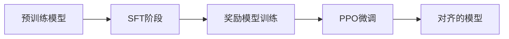

# 第4章：强化学习与RLHF深度解析

从人类反馈中学习（RLHF）已成为构建对齐AI系统的核心技术。本章深入探讨RLHF的理论基础、实践细节和最新进展。

## 章节目录

1. [RL基础与策略梯度方法](#section1)
2. [RLHF的完整流程剖析](#section2)
3. [奖励模型的设计与训练](#section3)
4. [PPO vs DPO vs IPO算法对比](#section4)
5. [Constitutional AI与自我改进](#section5)
6. [RLHF的挑战与未来](#section6)

---

## <a name="section1"></a>4.1 RL基础与策略梯度方法

理解RLHF需要先掌握强化学习的核心概念，特别是策略梯度方法在语言模型中的应用。

### 4.1.1 强化学习在LLM中的形式化

**状态、动作、奖励的定义：**

在语言生成任务中：
- **状态（State）** $s_t$：已生成的token序列 $[x_1, x_2, ..., x_t]$
- **动作（Action）** $a_t$：下一个要生成的token
- **策略（Policy）** $\pi_\theta$：语言模型本身，$P(a_t|s_t)$
- **奖励（Reward）** $r$：通常只在序列结束时给出

**马尔可夫决策过程（MDP）：**

在语言模型中，MDP可以形式化为：
- 状态空间 $\mathcal{S}$：所有可能的token序列
- 动作空间 $\mathcal{A}$：词表中的所有token
- 转移函数 $P(s_{t+1}|s_t, a_t)$：确定性的，将token追加到序列
- 奖励函数 $R(s_t, a_t)$：通常延迟到序列结束时给出
- 折扣因子 $\gamma$：通常设为1（无折扣的episode任务）

### 4.1.2 策略梯度定理

**目标函数：**
$$J(\theta) = \mathbb{E}_{\tau \sim \pi_\theta}[R(\tau)]$$

其中 $\tau = (s_0, a_0, s_1, a_1, ..., s_T)$ 是一个轨迹。

**策略梯度：**
$$\nabla_\theta J(\theta) = \mathbb{E}_{\tau \sim \pi_\theta}\left[\sum_{t=0}^T \nabla_\theta \log \pi_\theta(a_t|s_t) \cdot A_t\right]$$

其中 $A_t$ 是优势函数（Advantage Function）。

**REINFORCE算法实现：**

REINFORCE算法的核心步骤：
1. 采样轨迹：$\tau \sim \pi_\theta$
2. 计算回报：$G_t = \sum_{k=t}^T \gamma^{k-t} r_k$
3. 估计梯度：$\nabla_\theta J \approx \frac{1}{N} \sum_i \sum_t \nabla_\theta \log \pi_\theta(a_t^i|s_t^i) \cdot G_t^i$
4. 更新参数：$\theta \leftarrow \theta + \alpha \nabla_\theta J$

关键的PyTorch函数：
- `torch.distributions.Categorical`：采样动作
- `log_prob()`：计算对数概率
- `backward()`：反向传播计算梯度

### 4.1.3 基线与优势函数

**价值函数基线：**

使用价值函数 $V^{\pi}(s)$ 作为基线可以减少方差：
$$A_t = Q^{\pi}(s_t, a_t) - V^{\pi}(s_t) = r_t + \gamma V^{\pi}(s_{t+1}) - V^{\pi}(s_t)$$

价值函数通常通过一个独立的神经网络头来预测，使用均方误差损失训练：
$$L_V = \mathbb{E}_t[(V_\theta(s_t) - V_t^{target})^2]$$

其中 $V_t^{target}$ 是通过蒙特卡洛回报或TD目标计算得到。

**广义优势估计（GAE）：**
$$A_t^{GAE} = \sum_{l=0}^{\infty} (\gamma \lambda)^l \delta_{t+l}$$

其中 $\delta_t = r_t + \gamma V(s_{t+1}) - V(s_t)$ 是TD误差。

GAE通过参数 $\lambda$ 在偏差和方差之间权衡：
- $\lambda = 0$：退化为TD(0)，低方差但高偏差
- $\lambda = 1$：退化为蒙特卡洛估计，无偏但高方差

### 4.1.4 重要性采样与PPO

**重要性采样比率：**
$$r_t(\theta) = \frac{\pi_\theta(a_t|s_t)}{\pi_{\theta_{old}}(a_t|s_t)}$$

**PPO-Clip目标：**
$$L^{CLIP}(\theta) = \mathbb{E}_t\left[\min\left(r_t(\theta)A_t, \text{clip}(r_t(\theta), 1-\epsilon, 1+\epsilon)A_t\right)\right]$$

**PPO实现核心：**

PPO的完整损失函数包含三个部分：
$$L^{PPO}(\theta) = L^{CLIP}(\theta) - c_1 L^{VF}(\theta) + c_2 S[\pi_\theta]$$

其中：
- $L^{CLIP}$：裁剪的策略损失
- $L^{VF}$：价值函数损失
- $S[\pi_\theta]$：熵奖励，鼓励探索

关键超参数：
- $\epsilon$：裁剪范围（通常0.1-0.2）
- $c_1$：价值损失系数（通常0.5）
- $c_2$：熵系数（通常0.01）

### 4.1.5 KL散度约束

**为什么需要KL约束：**
防止策略更新过大，保持训练稳定性。

**KL惩罚方法：**
$$L(\theta) = \mathbb{E}_t[r_t(\theta)A_t] - \beta \cdot KL[\pi_\theta || \pi_{ref}]$$

#### 练习 4.1：实现简化版PPO训练循环
实现一个用于语言模型的PPO训练循环，包括采样、优势计算和参数更新。

<details>
<summary>查看答案</summary>

**简化版PPO训练实现步骤：**

1. **初始化**：
   - 加载预训练语言模型作为策略网络 $\pi_\theta$
   - 初始化价值网络 $V_\phi$
   - 设置优化器（通常使用AdamW）

2. **数据收集**：
   - 使用当前策略生成响应
   - 计算奖励（通过奖励模型）
   - 存储轨迹数据 $(s_t, a_t, r_t, \log\pi_{\theta_{old}}(a_t|s_t))$

3. **优势计算**：
   - 使用价值网络预测 $V(s_t)$
   - 计算TD误差：$\delta_t = r_t + \gamma V(s_{t+1}) - V(s_t)$
   - 计算GAE优势：$A_t = \sum_{l=0}^{T-t} (\gamma\lambda)^l \delta_{t+l}$

4. **PPO更新**（多个epoch）：
   - 计算重要性比率：$r_t = \pi_\theta(a_t|s_t) / \pi_{\theta_{old}}(a_t|s_t)$
   - 计算裁剪损失：$L^{CLIP} = -\min(r_t A_t, \text{clip}(r_t, 1-\epsilon, 1+\epsilon) A_t)$
   - 更新策略和价值网络

5. **KL监控**：
   - 计算 $KL[\pi_\theta || \pi_{\theta_{old}}]$
   - 如果KL过大，提前停止更新

**关键实现细节**：
- 使用 `torch.nn.utils.clip_grad_norm_` 防止梯度爆炸
- 归一化优势函数提高稳定性
- 使用多个minibatch进行更新
- 保存检查点以便恢复训练

</details>

### 4.1.6 策略梯度的方差缩减技术

**控制变量法：**

通过引入与奖励相关但期望为0的控制变量来减少方差：
$$\nabla_\theta J(\theta) = \mathbb{E}_{\tau}\left[\sum_t \nabla_\theta \log \pi_\theta(a_t|s_t) (Q(s_t,a_t) - b(s_t))\right]$$

最优基线是：
$$b^*(s_t) = \frac{\mathbb{E}_{a_t}[\|\nabla_\theta \log \pi_\theta(a_t|s_t)\|^2 Q(s_t,a_t)]}{\mathbb{E}_{a_t}[\|\nabla_\theta \log \pi_\theta(a_t|s_t)\|^2]}$$

实践中通常使用价值函数 $V(s_t)$ 作为基线的近似。

**归一化技巧：**

1. **优势标准化**：
   $$\hat{A}_t = \frac{A_t - \mu_A}{\sigma_A + \epsilon}$$
   
2. **奖励归一化**：
   - 运行均值和标准差跟踪
   - 分位数归一化
   - 奖励裁剪

3. **梯度裁剪**：
   - 按范数裁剪：限制 $\|\nabla_\theta\|_2 \leq \text{max\_norm}$
   - 按值裁剪：限制每个梯度分量

**⚡ 设计选择：**
PPO在语言模型中的设计权衡：
- Clip范围：太小限制学习，太大失去稳定性
- KL惩罚：硬约束vs软约束
- 价值函数：独立网络vs共享主干
- 批次大小：大批次稳定但计算昂贵

**🔬 研究线索：**
- 如何更好地处理稀疏奖励问题？
- 离线RL在RLHF中的应用？
- 多目标RL如何平衡不同对齐目标？

---

## <a name="section2"></a>4.2 RLHF的完整流程剖析

RLHF不是单一技术，而是一个包含多个阶段的复杂流程。本节详细剖析每个阶段的设计与实现。

### 4.2.1 RLHF三阶段概览

**完整流程：**



**各阶段的作用：**
1. **SFT（监督微调）**：建立基础能力
2. **奖励建模**：学习人类偏好
3. **RL微调**：优化偏好对齐

### 4.2.2 阶段1：监督微调（SFT）

**为什么需要SFT：**
- 让模型学会基本的指令遵循格式
- 提供良好的初始策略
- 减少RL阶段的探索难度

**SFT数据构建：**

1. **数据来源**：
   - 人工编写的高质量指令-响应对
   - 从现有数据集筛选和清洗
   - 使用强模型生成并人工验证

2. **数据格式化**：
   - 统一的prompt模板
   - 明确的系统指令
   - 多轮对话的正确拼接

3. **数据质量要求**：
   - 指令的多样性和覆盖面
   - 响应的准确性和帮助性
   - 安全性和价值观对齐

**SFT训练策略：**

1. **损失函数设计**：
   $$L_{SFT} = -\sum_{t=1}^T \log p_\theta(y_t | x, y_{<t})$$
   
   其中只在响应部分计算损失，输入部分被mask。

2. **训练技巧**：
   - 学习率预热和余弦退火
   - 梯度累积处理长序列
   - 早停防止过拟合
   - 使用`torch.nn.CrossEntropyLoss`与`ignore_index`参数

3. **数据采样策略**：
   - 按任务类型平衡采样
   - 长度分桶提高效率
   - 动态调整困难样本权重

### 4.2.3 阶段2：偏好数据收集

**偏好数据的类型：**

**1. 成对比较：**
给定prompt $x$ 和两个响应 $y_1, y_2$，标注者选择偏好的响应：
- 二元选择：$y_1 \succ y_2$ 或 $y_2 \succ y_1$
- 包含平局：增加"同样好"选项
- 带置信度：1-5分的偏好强度

**2. 评分数据：**
对单个响应直接打分：
- 李克特量表（1-7分）
- 多维度评分（帮助性、安全性、真实性等）
- 二元标签（好/坏）

**3. 排序数据：**
对多个响应进行完整排序：
$$y_{\sigma(1)} \succ y_{\sigma(2)} \succ ... \succ y_{\sigma(k)}$$

**偏好数据质量控制：**

1. **标注者一致性检查**：
   - 计算标注者间一致性（Cohen's κ）
   - 黄金标准题目验证
   - 多人标注取多数票

2. **数据清洗**：
   - 过滤低质量prompt
   - 去除明显错误的标注
   - 平衡不同类型的偏好

3. **主动学习采样**：
   - 优先标注模型不确定的样本
   - 确保偏好边界的覆盖
   - 避免简单样本的过度采样

### 4.2.4 阶段3：奖励模型训练

**奖励模型架构：**

通常基于预训练语言模型构建：
1. **编码器**：使用预训练LM的transformer层
2. **池化层**：
   - 最后token池化（适用于有结束符的场景）
   - 平均池化（对所有token求平均）
   - 注意力池化（学习权重）
3. **奖励头**：线性层输出标量奖励值

**奖励模型损失函数：**

基于Bradley-Terry模型的排序损失：
$$L_{RM} = -\mathbb{E}_{(x,y_w,y_l) \sim D}\left[\log \sigma(r_\theta(x,y_w) - r_\theta(x,y_l))\right]$$

其中 $y_w$ 是偏好的响应，$y_l$ 是不偏好的响应。

**训练技巧**：
- 奖励归一化防止数值不稳定
- 使用margin损失增加鲁棒性
- 多任务学习同时预测多个偏好维度

### 4.2.5 阶段4：PPO训练

**完整PPO流程整合：**

1. **初始化**：
   - 策略模型：SFT后的语言模型 $\pi_\theta$
   - 参考模型：SFT模型的副本 $\pi_{ref}$（冻结）
   - 奖励模型：训练好的 $r_\phi$（冻结）
   - 价值模型：随机初始化的 $V_\psi$

2. **训练循环**：
   ```
   for each iteration:
       1. 采样prompts批次
       2. 生成响应：y ~ π_θ(·|x)
       3. 计算奖励：r = r_φ(x,y)
       4. 计算KL惩罚：KL[π_θ||π_ref]
       5. 总奖励：R = r - β·KL
       6. 运行PPO更新
   ```

3. **关键超参数**：
   - KL系数 $\beta$：通常0.01-0.1
   - PPO clip范围：0.1-0.2
   - 训练步数：通常几千步
   - 批次大小：受限于生成成本

4. **训练监控**：
   - 奖励模型分数的变化
   - KL散度增长
   - 生成质量的人工评估
   - 下游任务性能

#### 练习 4.2：实现RLHF数据收集pipeline
设计并实现一个完整的RLHF数据收集系统，包括响应生成、人类标注接口和质量控制。

<details>
<summary>查看答案</summary>

**RLHF数据收集系统实现：**

1. **系统架构设计**：
   - **响应生成模块**：管理多个模型版本，生成多样化响应
   - **标注接口**：用户友好的UI，支持成对比较和评分
   - **质量控制模块**：自动检测异常标注，计算一致性指标
   - **数据存储**：版本控制的数据管理系统

2. **响应生成策略**：
   - 温度采样：不同temperature生成多样化响应
   - 对比采样：故意生成一些低质量响应作为负例
   - 多模型采样：使用不同checkpoint或模型架构

3. **标注流程设计**：
   - **预筛选**：自动过滤明显有问题的响应
   - **分配策略**：确保每个样本被多人标注
   - **指导原则**：清晰的标注指南和示例
   - **培训流程**：标注者需通过测试题

4. **质量保证机制**：
   - **一致性检查**：Fleiss' Kappa > 0.4
   - **黄金数据**：10%已知答案的测试题
   - **异常检测**：标注速度、模式分析
   - **反馈循环**：定期更新标注指南

5. **数据处理pipeline**：
   ```
   原始标注 → 一致性过滤 → 聚合处理 → 
   格式转换 → 训练集划分 → 最终数据集
   ```

**关键实现细节**：
- 使用数据库事务确保数据一致性
- 实现增量式数据收集，支持在线更新
- 标注界面响应时间 < 100ms
- 支持多语言和特殊领域的标注

</details>

### 4.2.6 RLHF的实验追踪

**综合实验管理：**

1. **指标追踪**：
   - **训练指标**：PPO loss、KL divergence、奖励分数
   - **验证指标**：held-out偏好准确率、下游任务性能
   - **系统指标**：生成速度、内存使用、训练时间

2. **实验版本控制**：
   - 模型checkpoints管理
   - 超参数配置追踪
   - 数据集版本记录
   - 随机种子固定

3. **A/B测试框架**：
   - 在线评估不同RLHF变体
   - 用户反馈收集
   - 统计显著性检验

4. **可视化工具**：
   - 奖励分布变化图
   - KL散度增长曲线
   - 响应长度分布
   - 失败案例分析

**🔬 研究线索：**
- 如何减少RLHF所需的人类标注量？
- 能否用AI反馈替代部分人类反馈？
- 如何处理标注者之间的价值观差异？

---

## <a name="section3"></a>4.3 奖励模型的设计与训练

奖励模型是RLHF的核心组件，它学习人类偏好并指导策略优化。本节深入探讨奖励模型的设计细节。

### 4.3.1 奖励模型的理论基础

**Bradley-Terry模型：**
人类偏好可以建模为：
$$P(y_1 \succ y_2 | x) = \frac{\exp(r(x, y_1))}{\exp(r(x, y_1)) + \exp(r(x, y_2))} = \sigma(r(x, y_1) - r(x, y_2))$$

其中 $r(x, y)$ 是奖励函数，$\sigma$ 是sigmoid函数。

**Plackett-Luce模型（多选项排序）：**
$$P(\tau | x) = \prod_{i=1}^{K-1} \frac{\exp(r(x, y_{\tau(i)}))}{\sum_{j=i}^{K} \exp(r(x, y_{\tau(j)}))}$$

### 4.3.2 奖励模型架构设计

**基础架构：**

1. **输入编码**：
   - Prompt和响应拼接：`[CLS] prompt [SEP] response [EOS]`
   - 位置编码：区分prompt和response部分
   - Attention mask：正确处理padding

2. **特征提取层**：
   - 复用预训练LM的transformer层
   - 可选：微调最后几层或全部层
   - 参数效率：LoRA适配器

3. **输出层设计**：
   - 标量奖励：单个数值输出
   - 多维奖励：帮助性、安全性、真实性等
   - 不确定性估计：输出均值和方差

**高级特征提取：**

1. **层次化池化**：
   $$h_{pool} = \alpha \cdot h_{last} + (1-\alpha) \cdot \text{mean}(h_{1:T})$$
   
2. **注意力池化**：
   $$h_{pool} = \sum_{t=1}^T \alpha_t h_t, \quad \alpha_t = \frac{\exp(w^T h_t)}{\sum_{j=1}^T \exp(w^T h_j)}$$

3. **多尺度特征融合**：
   - Token级别特征
   - 句子级别特征
   - 文档级别特征

### 4.3.3 训练数据准备

**数据格式与预处理：**

1. **标准化格式**：
   - 成对比较：`(prompt, chosen, rejected)`
   - 评分数据：`(prompt, response, score)`
   - 排序数据：`(prompt, [response1, response2, ...], ranking)`

2. **预处理步骤**：
   - 长度截断：限制最大token数
   - 去重：移除重复的prompt-response对
   - 平衡：确保正负样本比例合适
   - 验证：检查标注一致性

**数据增强技术：**

1. **对比挖掘**：
   - 从同一prompt的多个响应中构造更多对比
   - 利用评分差异生成偏好对

2. **难例挖掘**：
   - 选择模型预测置信度低的样本
   - 选择人类标注分歧大的样本

3. **合成数据生成**：
   - 使用强模型生成额外的偏好数据
   - 通过扰动创建负例
   - 交叉验证确保质量

### 4.3.4 损失函数设计

**基础排序损失：**

标准的Bradley-Terry损失：
$$L_{BT} = -\log \sigma(r_\theta(x, y_w) - r_\theta(x, y_l))$$

带margin的变体：
$$L_{margin} = \max(0, m - (r_\theta(x, y_w) - r_\theta(x, y_l)))$$

其中 $m$ 是期望的最小差距。

**加权Bradley-Terry损失：**

根据标注置信度加权：
$$L_{weighted} = -w_{i} \cdot \log \sigma(r_\theta(x, y_w) - r_\theta(x, y_l))$$

其中权重 $w_i$ 可以基于：
- 标注者一致性
- 偏好强度
- 样本难度

**多任务学习损失：**

同时优化多个目标：
$$L_{total} = \lambda_1 L_{helpful} + \lambda_2 L_{safe} + \lambda_3 L_{truthful}$$

每个子任务可以有：
- 独立的奖励头
- 共享的特征提取器
- 任务特定的权重

### 4.3.5 训练策略与技巧

**课程学习：**

1. **难度递进**：
   - 从明显的偏好差异开始
   - 逐渐引入细微差别的样本
   - 最后处理边界案例

2. **样本调度策略**：
   $$p(s_i) = \frac{\exp(\alpha \cdot \text{difficulty}_i)}{\sum_j \exp(\alpha \cdot \text{difficulty}_j)}$$
   
   其中 $\alpha$ 随训练进程增加。

3. **动态采样**：
   - 根据当前模型性能调整数据分布
   - 重点采样模型表现差的类别

**对比学习增强：**

1. **特征空间对比**：
   $$L_{contrastive} = -\log \frac{\exp(\text{sim}(h_w, h_w^+)/\tau)}{\sum_{i} \exp(\text{sim}(h_w, h_i)/\tau)}$$

2. **数据增强策略**：
   - 同义词替换保持语义
   - 句子重排保持逻辑
   - 风格迁移保持内容

3. **负样本构造**：
   - 硬负样本挖掘
   - 梯度引导的对抗样本
   - 混合不同响应的部分

#### 练习 4.3：实现集成奖励模型
设计并实现一个集成多个奖励模型的系统，提高预测的稳定性和准确性。

<details>
<summary>查看答案</summary>

**集成奖励模型实现：**

1. **集成策略设计**：
   - **模型多样性**：不同架构、初始化、训练数据子集
   - **聚合方法**：
     - 平均：$r_{ensemble} = \frac{1}{N}\sum_{i=1}^N r_i(x,y)$
     - 加权平均：$r_{ensemble} = \sum_{i=1}^N w_i \cdot r_i(x,y)$
     - 中位数：鲁棒性更好
   - **投票机制**：用于分类形式的偏好预测

2. **不确定性估计**：
   - **认知不确定性**（模型不确定性）：
     $$\sigma^2_{epistemic} = \frac{1}{N}\sum_{i=1}^N (r_i(x,y) - \bar{r}(x,y))^2$$
   - **偶然不确定性**（数据不确定性）：
     通过模型内部的方差预测
   - **应用**：识别需要更多标注的样本

3. **动态权重调整**：
   - 基于验证集性能：$w_i \propto \exp(\alpha \cdot \text{acc}_i)$
   - 基于预测一致性：降低离群预测的权重
   - 基于专长领域：不同模型处理不同类型prompt

4. **训练策略**：
   - **独立训练**：每个模型独立优化
   - **知识蒸馏**：强模型指导弱模型
   - **对抗训练**：提高鲁棒性
   - **Bootstrap采样**：增加多样性

5. **推理优化**：
   - 模型并行加速
   - 早停机制：置信度高时跳过部分模型
   - 缓存机制：存储常见query的结果

**关键实现细节**：
- 使用 `torch.nn.ModuleList` 管理多个模型
- 实现高效的批处理，共享相同的输入编码
- 监控各模型的预测分布，检测异常
- 定期重新校准权重

</details>

### 4.3.6 奖励模型的评估

**评估指标：**

1. **准确性指标**：
   - **成对准确率**：正确预测偏好方向的比例
   - **排序相关性**：Spearman/Kendall相关系数
   - **Calibration误差**：预测置信度与实际准确率的差异

2. **鲁棒性指标**：
   - **分布外泛化**：在新领域/任务上的表现
   - **对抗鲁棒性**：对恶意构造输入的抵抗力
   - **一致性**：相似输入的预测稳定性

3. **效率指标**：
   - **推理延迟**：单次预测时间
   - **内存占用**：模型大小和运行时内存
   - **吞吐量**：批处理能力

4. **下游影响**：
   - **RLHF后的模型质量**
   - **人类评估对齐度**
   - **安全性指标**

**🔬 研究线索：**
- 如何设计对分布外数据更鲁棒的奖励模型？
- 能否用主动学习减少所需的偏好标注？
- 如何处理奖励模型的过度优化问题？

---

## <a name="section4"></a>4.4 PPO vs DPO vs IPO算法对比

除了PPO，还有其他方法可以从人类反馈中学习。本节比较主流的对齐算法。

### 4.4.1 直接偏好优化（DPO）

**DPO的核心思想：**
将RLHF的奖励建模和RL优化合并为单一目标。

**理论推导：**
从RL目标出发：
$$\max_{\pi} \mathbb{E}_{x \sim D, y \sim \pi}[r(x,y)] - \beta KL[\pi || \pi_{ref}]$$

可以推导出最优策略：
$$\pi^*(y|x) = \frac{1}{Z(x)} \pi_{ref}(y|x) \exp\left(\frac{r(x,y)}{\beta}\right)$$

反过来，奖励函数可以表示为：
$$r(x,y) = \beta \log \frac{\pi(y|x)}{\pi_{ref}(y|x)} + \beta \log Z(x)$$

**DPO损失函数：**

将偏好数据直接转化为策略优化：
$$L_{DPO}(\theta) = -\mathbb{E}_{(x,y_w,y_l)}\left[\log \sigma\left(\beta \log \frac{\pi_\theta(y_w|x)}{\pi_{ref}(y_w|x)} - \beta \log \frac{\pi_\theta(y_l|x)}{\pi_{ref}(y_l|x)}\right)\right]$$

这个损失函数直接优化策略，无需显式的奖励模型。

**DPO训练流程：**

1. **数据准备**：使用与奖励模型相同的偏好数据
2. **参考模型**：通常使用SFT模型作为 $\pi_{ref}$
3. **优化过程**：
   - 计算策略模型和参考模型的log概率
   - 计算log概率比率的差异
   - 通过sigmoid和交叉熵优化
4. **关键优势**：
   - 避免了奖励模型训练
   - 没有RL的不稳定性
   - 计算效率更高

### 4.4.2 身份偏好优化（IPO）

**IPO的动机：**
DPO在某些情况下可能过拟合，IPO通过不同的损失函数设计来缓解这个问题。

**IPO损失函数：**

IPO使用更简单的平方损失代替对数损失：
$$L_{IPO}(\theta) = \mathbb{E}_{(x,y_w,y_l)}\left[\left(\log \frac{\pi_\theta(y_w|x)}{\pi_{ref}(y_w|x)} - \log \frac{\pi_\theta(y_l|x)}{\pi_{ref}(y_l|x)} - \frac{1}{2\beta}\right)^2\right]$$

关键差异：
- 平方损失对离群值更敏感
- 包含一个偏移项 $\frac{1}{2\beta}$
- 理论上与不同的f-divergence相关

**IPO的优势**：
1. 更稳定的优化过程
2. 对超参数不太敏感
3. 在某些任务上表现更好

### 4.4.3 算法对比分析

**实现统一接口：**

为了公平比较，所有算法应该：
1. 使用相同的预训练模型和SFT checkpoint
2. 使用相同的偏好数据集
3. 使用相似的计算预算
4. 在相同的评估集上测试

**性能基准测试：**

评估维度：
1. **对齐质量**：
   - Win rate vs 基线模型
   - 人类评估分数
   - 自动化指标（困惑度、BLEU等）

2. **训练效率**：
   - 收敛速度
   - 计算资源需求
   - 内存使用

3. **泛化能力**：
   - 分布外任务表现
   - Few-shot学习能力
   - 鲁棒性测试

**算法特性对比：**

| 特性 | PPO | DPO | IPO |
|------|-----|-----|-----|
| 需要奖励模型 | ✓ | ✗ | ✗ |
| 需要在线采样 | ✓ | ✗ | ✗ |
| 训练稳定性 | 中 | 高 | 高 |
| 计算效率 | 低 | 高 | 高 |
| 理论保证 | 有 | 有 | 有 |
| 超参数敏感度 | 高 | 低 | 低 |

#### 练习 4.4：实现算法选择器
设计一个系统，根据数据特性和资源约束自动选择最合适的对齐算法。

<details>
<summary>查看答案</summary>

**智能算法选择器实现：**

1. **数据特征分析**：
   - **偏好强度分布**：计算chosen和rejected的差异程度
     $$\text{strength} = \mathbb{E}[|score_{chosen} - score_{rejected}|]$$
   - **数据规模**：样本数量和多样性
   - **标注一致性**：多标注者的agreement程度
   - **领域覆盖度**：prompt类型的分布

2. **资源约束评估**：
   - **计算预算**：可用GPU时间
   - **内存限制**：模型大小约束
   - **延迟要求**：在线服务的响应时间
   - **迭代频率**：模型更新周期

3. **算法推荐逻辑**：
   ```
   如果 计算资源充足 且 需要在线适应:
       推荐 PPO
   如果 偏好数据高质量 且 计算资源有限:
       推荐 DPO
   如果 需要稳定训练 且 数据有噪声:
       推荐 IPO
   如果 多阶段优化:
       先DPO后PPO微调
   ```

4. **性能预测模型**：
   基于历史数据训练元学习器：
   $$\text{score} = f(data\_features, resource\_constraints, algorithm)$$

5. **自适应策略**：
   - **早期阶段**：使用DPO快速收敛
   - **精调阶段**：切换到PPO细化
   - **特定任务**：根据任务特性选择
   - **A/B测试**：并行运行多种算法

**关键决策因素**：
- 数据量 < 10k：优先DPO/IPO
- 需要实时奖励：必须PPO
- 稳定性要求高：IPO > DPO > PPO
- 性能上限：PPO > DPO ≈ IPO

</details>

### 4.4.4 混合方法

**结合不同算法的优势：**

1. **分阶段训练**：
   - **阶段1**：DPO预训练，快速建立基础对齐
   - **阶段2**：PPO微调，优化特定指标
   - **阶段3**：IPO稳定化，提高鲁棒性

2. **集成方法**：
   $$\pi_{ensemble} = \alpha_1 \pi_{PPO} + \alpha_2 \pi_{DPO} + \alpha_3 \pi_{IPO}$$
   
   权重可以基于验证集性能动态调整。

3. **混合损失函数**：
   $$L_{hybrid} = \lambda_{DPO} L_{DPO} + \lambda_{reg} L_{regularization}$$
   
   结合直接优化和正则化项。

4. **自适应切换**：
   - 监控训练指标（KL散度、奖励分数）
   - 根据进展自动切换算法
   - 保持训练的连续性

**⚡ 设计选择：**
选择对齐算法时的考虑因素：
- 计算资源：PPO最昂贵，DPO/IPO更高效
- 数据质量：DPO/IPO对数据质量要求更高
- 灵活性：PPO可以使用任意奖励函数
- 实现复杂度：DPO/IPO更简单

**🔬 研究线索：**
- 能否设计结合在线和离线优势的新算法？
- 如何自适应选择不同阶段的算法？
- 是否存在理论最优的对齐算法？

---

[← 返回目录](index.md) | [上一节：奖励模型的设计与训练 →](#section3) | [下一节：Constitutional AI与自我改进 →](#section5)

---

## <a name="section5"></a>4.5 Constitutional AI与自我改进

Constitutional AI (CAI) 提供了一种通过AI自身进行对齐的新范式，减少对人类标注的依赖。

### 4.5.1 Constitutional AI的核心理念

**基本原理：**

CAI通过一组明确的原则（constitution）来指导模型的行为，而不是依赖大量的人类偏好数据。

**两阶段过程：**
1. **监督阶段**：使用AI批评和修订自己的输出
2. **强化学习阶段**：基于AI生成的偏好数据进行训练

**Constitution设计：**
包含多个原则，例如：
- 有帮助性（Helpful）
- 诚实性（Honest）
- 无害性（Harmless）
- 具体的行为准则

### 4.5.2 自我批评与修订机制

**批评-修订循环：**

1. **初始生成**：模型生成原始响应
2. **自我批评**：
   $$\text{Critique} = f_{critic}(\text{Response}, \text{Principles})$$
3. **修订生成**：
   $$\text{Revised} = f_{revise}(\text{Response}, \text{Critique})$$
4. **迭代改进**：重复直到满足所有原则

**批评提示设计：**
- 检查是否违反特定原则
- 识别潜在的有害内容
- 建议具体的改进方向

**修订策略：**
- 保持原始意图
- 最小化改动
- 确保流畅性

### 4.5.3 AI反馈的强化学习（RLAIF）

**从AI反馈生成偏好数据：**

1. **生成多个响应**：
   对同一prompt生成 $k$ 个不同的响应

2. **AI评估打分**：
   $$s_i = f_{evaluate}(x, y_i, \text{Constitution})$$

3. **构造偏好对**：
   选择分数差异显著的对：$(y_i, y_j)$ where $s_i > s_j + \epsilon$

**RLAIF训练流程：**

与RLHF类似，但使用AI生成的偏好：
$$L_{RLAIF} = -\mathbb{E}_{(x,y_{AI}^+,y_{AI}^-)}\left[\log \sigma(r_\theta(x,y_{AI}^+) - r_\theta(x,y_{AI}^-))\right]$$

**质量控制机制：**
- 过滤低置信度的偏好
- 人类验证关键样本
- 多样性保证

### 4.5.4 自我改进的迭代训练

**迭代改进循环：**

```
模型_0 → 生成数据 → AI评估 → 训练 → 模型_1
   ↑                                    ↓
   ←────────────────────────────────────
```

**关键技术：**

1. **自举（Bootstrapping）**：
   - 使用当前模型生成训练数据
   - 通过Constitutional过滤确保质量
   - 防止质量退化

2. **探索与利用平衡**：
   $$p(a|s) = (1-\epsilon) \cdot \pi_{current}(a|s) + \epsilon \cdot \pi_{explore}(a|s)$$

3. **增量学习**：
   - 保留历史最佳样本
   - 渐进式难度增加
   - 防止灾难性遗忘

### 4.5.5 Constitutional原则的设计

**原则层次结构：**

1. **基础原则**：
   - 安全性：不产生有害内容
   - 真实性：不编造事实
   - 有用性：提供价值

2. **领域特定原则**：
   - 医疗：遵守医疗伦理
   - 法律：不提供法律建议
   - 教育：适龄性考虑

3. **细粒度规则**：
   - 格式要求
   - 语气控制
   - 长度限制

**原则的数学表示：**

每个原则可以表示为一个评分函数：
$$p_i(x, y) \in [0, 1]$$

总体满足度：
$$P(x, y) = \prod_{i=1}^n p_i(x, y)^{w_i}$$

其中 $w_i$ 是原则权重。

#### 练习 4.5：设计Constitutional AI系统
设计一个完整的CAI系统，包括原则定义、自我批评机制和迭代改进流程。

<details>
<summary>查看答案</summary>

**Constitutional AI系统设计：**

1. **原则体系设计**：
   - **核心原则库**：
     - 安全原则：识别和避免有害内容
     - 准确原则：事实核查和不确定性表达
     - 有用原则：相关性和完整性检查
   - **原则优先级**：
     安全 > 准确 > 有用
   - **冲突解决**：
     当原则冲突时的决策树

2. **批评生成系统**：
   - **多角度批评**：
     - 内容批评：检查事实和逻辑
     - 风格批评：语气和表达方式
     - 合规批评：是否违反原则
   - **批评模板**：
     "这个响应在[原则X]方面存在问题，因为[具体原因]"
   - **严重程度评分**：
     1-5级，用于决定是否需要修订

3. **修订生成策略**：
   - **最小编辑原则**：
     计算编辑距离，选择改动最小的修订
   - **保持连贯性**：
     确保修订后的文本流畅自然
   - **多轮修订**：
     每轮专注于一个原则，避免过度修改

4. **自动评估机制**：
   - **原则满足度计算**：
     $$\text{Score} = \sum_{i} w_i \cdot \text{principle}_i(response)$$
   - **对比评分**：
     生成多个版本，选择得分最高的
   - **置信度估计**：
     低置信度样本人工复核

5. **迭代训练pipeline**：
   - **数据生成**：
     - Prompt采样策略
     - 响应多样性控制
     - 难度递进安排
   - **质量过滤**：
     - Constitutional一致性检查
     - 多样性和覆盖度分析
     - 异常检测
   - **训练策略**：
     - 课程学习：从简单到复杂
     - 正则化：防止过拟合到AI反馈
     - 检查点选择：基于held-out人类评估

**实施要点**：
- 定期人类审计，防止偏差累积
- 保持原则的可解释性
- 建立反馈循环，持续改进原则
- 监控自我改进的收敛性

</details>

### 4.5.6 CAI的优势与局限

**优势：**
1. **可扩展性**：减少人工标注需求
2. **一致性**：原则明确，行为可预测
3. **可解释性**：基于明确的规则
4. **快速迭代**：自动化改进循环

**局限性：**
1. **原则设计难度**：难以覆盖所有情况
2. **偏见放大风险**：AI可能强化自身偏见
3. **质量上限**：受限于AI自身能力
4. **验证困难**：需要人类最终把关

**⚡ 设计选择：**
- 原则的粒度：太细难以泛化，太粗难以执行
- 人类参与度：完全自动化vs人机协作
- 评估标准：AI评估vs人类评估的权衡
- 更新频率：快速迭代vs稳定性

**🔬 研究线索：**
- 如何设计更好的Constitutional原则？
- 能否自动发现和学习新的原则？
- 如何结合CAI和传统RLHF的优势？
- 多智能体Constitutional系统的可能性？

---

## <a name="section6"></a>4.6 RLHF的挑战与未来

RLHF技术虽然取得了显著成功，但仍面临诸多挑战。本节探讨这些挑战及未来发展方向。

### 4.6.1 当前RLHF的主要挑战

**1. 奖励黑客（Reward Hacking）：**

模型学会利用奖励模型的缺陷：
$$\pi^* = \arg\max_\pi \mathbb{E}[r_{model}(x,y)] \neq \arg\max_\pi \mathbb{E}[r_{true}(x,y)]$$

表现形式：
- 过度优化某些容易获得高分的模式
- 生成看似合理但实际无意义的内容
- 长度偏见：倾向生成冗长响应

**2. 分布偏移问题：**

训练分布与部署分布的差异：
$$D_{train}(x) \neq D_{deploy}(x)$$

导致的问题：
- 对新领域的泛化能力差
- 面对对抗性输入时的脆弱性
- 长尾场景的处理不足

**3. 标注成本与质量：**
- 高质量标注昂贵且耗时
- 标注者之间的不一致性
- 文化和价值观差异
- 专业领域知识的缺乏

**4. 多目标平衡困难：**

多个对齐目标之间的权衡：
$$L_{total} = \sum_i \lambda_i L_i$$

如何设置 $\lambda_i$ 是个难题。

### 4.6.2 理论挑战与研究方向

**1. 理论保证的缺失：**

- RLHF的收敛性证明
- 最优性保证
- 泛化界限

**2. 因果推理与对齐：**

将因果推理引入对齐：
$$do(X=x) \rightarrow Y$$

而不仅仅是相关性：
$$P(Y|X=x)$$

**3. 可解释的对齐：**

- 理解模型为什么做出特定选择
- 对齐决策的可审计性
- 失败模式的诊断

### 4.6.3 新兴技术方向

**1. 弱到强泛化（Weak-to-Strong Generalization）：**

使用弱监督信号训练强模型：
$$\text{Weak Supervisor} \rightarrow \text{Strong Model}$$

关键挑战：
- 如何从不完美的监督中学习
- 超越监督者能力的泛化
- 置信度校准

**2. 多模态RLHF：**

扩展到视觉、音频等模态：
$$r(x_{text}, x_{image}, y) = f_{fusion}(r_{text}, r_{visual})$$

技术要点：
- 跨模态的偏好建模
- 模态间的一致性
- 计算效率优化

**3. 持续学习与适应：**

在线适应新的偏好和要求：
$$\pi_{t+1} = \text{Update}(\pi_t, D_{new})$$

同时保持：
$$\text{Performance}(\pi_{t+1}, D_{old}) \approx \text{Performance}(\pi_t, D_{old})$$

### 4.6.4 实践中的改进方向

**1. 混合人机标注：**

- AI预标注 + 人类验证
- 主动学习选择标注样本
- 置信度引导的标注分配

**2. 鲁棒性增强：**

对抗训练：
$$\min_\theta \max_{\delta} L(\theta, x + \delta)$$

分布鲁棒优化：
$$\min_\theta \max_{P \in \mathcal{P}} \mathbb{E}_{P}[L(\theta)]$$

**3. 高效训练方法：**

- 参数高效的RLHF（如LoRA-RLHF）
- 离线RL技术的应用
- 模型蒸馏加速

### 4.6.5 伦理与社会影响

**1. 价值对齐的哲学问题：**
- 谁的价值？
- 如何处理价值冲突？
- 文化相对性

**2. 安全性考虑：**
- 防止恶意使用
- 失控风险
- 可控性保证

**3. 公平性与包容性：**
- 避免偏见放大
- 少数群体的代表性
- 全球化视角

#### 练习 4.6：设计下一代RLHF系统
设计一个解决当前RLHF主要挑战的改进系统，包括理论创新和实践优化。

<details>
<summary>查看答案</summary>

**下一代RLHF系统设计：**

1. **多层次奖励建模**：
   - **即时奖励**：token级别的密集奖励
     $$r_t = r_{local}(s_t, a_t) + \gamma \cdot r_{future}(s_t)$$
   - **轨迹奖励**：完整响应的整体评估
   - **长期影响**：考虑对话历史和未来影响

2. **鲁棒性机制**：
   - **集成奖励模型**：
     $$r_{robust} = \text{median}(r_1, r_2, ..., r_n)$$
   - **不确定性感知**：
     低置信度时请求人类介入
   - **对抗验证**：
     定期测试奖励黑客

3. **自适应学习系统**：
   - **元学习框架**：
     $$\theta_{task} = \theta_{meta} + \Delta\theta_{task}$$
   - **在线偏好学习**：
     实时更新偏好模型
   - **个性化对齐**：
     用户级别的微调

4. **理论保证**：
   - **PAC-Bayesian界限**：
     $$P(R(\pi) \leq \hat{R}(\pi) + B) \geq 1 - \delta$$
   - **遗憾界限**：
     $$\text{Regret}_T \leq O(\sqrt{T \log T})$$

5. **高效实现**：
   - **分布式RLHF**：
     - 数据并行的奖励计算
     - 模型并行的策略更新
   - **增量更新**：
     - 只更新变化的部分
     - 缓存重用
   - **混合精度训练**：
     - 策略网络FP16
     - 奖励模型INT8

6. **监控与调试**：
   - **实时dashbaord**：
     - 奖励分布可视化
     - KL散度追踪
     - 异常检测告警
   - **可解释性工具**：
     - 注意力分析
     - 决策路径追踪
   - **A/B测试框架**：
     - 自动实验设计
     - 统计显著性检验

**实施路线图**：
1. 短期（3-6月）：改进奖励模型鲁棒性
2. 中期（6-12月）：实现自适应学习
3. 长期（12-24月）：建立理论保证

</details>

### 4.6.6 未来展望

**技术趋势：**

1. **自主对齐**：减少人类参与
2. **可验证对齐**：数学保证
3. **动态对齐**：实时适应
4. **多智能体对齐**：协作场景

**研究前沿：**

- 神经符号结合的对齐方法
- 量子计算加速RLHF
- 生物启发的奖励机制
- 社会选择理论的应用

**⚡ 设计选择：**
- 效率vs效果：更快的算法可能牺牲质量
- 通用vs专用：针对特定领域优化
- 集中vs分布式：计算资源的分配
- 自动vs人工：人类参与的程度

**🔬 研究线索：**
- 如何设计可证明安全的RLHF？
- 能否实现无需人类标注的对齐？
- 如何处理价值观的动态变化？
- 是否存在对齐的根本限制？

---

## 本章小结

本章深入探讨了RLHF的理论基础和实践技术：

1. **RL基础**：理解了策略梯度方法和PPO算法在LLM中的应用
2. **RLHF流程**：掌握了从SFT到奖励建模再到RL优化的完整pipeline
3. **奖励模型**：学习了设计和训练高质量奖励模型的技术
4. **算法对比**：比较了PPO、DPO、IPO等不同对齐算法的优劣
5. **CAI方法**：探索了使用AI自身进行对齐的新范式
6. **未来方向**：了解了RLHF面临的挑战和发展趋势

关键要点：
- RLHF是目前最有效的LLM对齐技术
- 不同算法各有优劣，需根据场景选择
- Constitutional AI提供了减少人类标注的新思路
- 仍有许多理论和实践挑战需要解决

下一章将探讨如何培养LLM的深度推理能力，特别是长思维链技术的原理与实现。

---

[← 返回目录](index.md) | [上一章：微调技术与对齐方法 →](chapter3.md) | [下一章：长思维链与推理能力培养 →](chapter5.md)